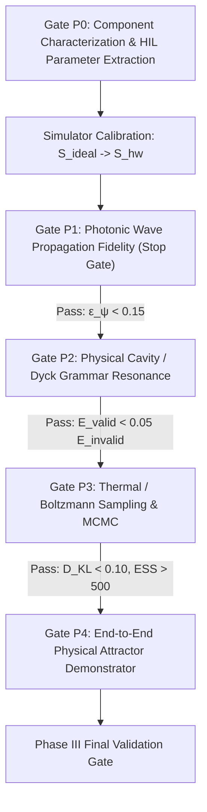

# Phase III Execution Plan: Physical Substrate Validation
## Operational Blueprint for Gate-by-Gate Hardware Characterization & Attractor Demonstration

* **Document ID:** `PHASE_III_EXECUTION_PLAN.md`
* **Status:** `ACTIVE OPERATIONAL DIRECTIVE` (Sole Operational Document for Phase III)
* **Predecessor Milestones:** Phase I (Empirical Discovery ✓), Phase II (Architecture Consolidation RFC-001–005 ✓)
* **Target Milestone:** Prototype v0.1 Physical Attractor Demonstrator
* **Core Objective:** Empirically validate that physical hardware substrates faithfully realize the mathematical operators specified in RFC-001 through RFC-005.

---

## 1. Phase Mission & Non-Negotiable Guardrails

### 1.1 Fundamental Premise
> [!IMPORTANT]
> **Phase III is NOT about building a "Hardware PhysLM".**  
> It is an empirical validation of physical substrate primitives. Before attempting language modeling, we must answer one fundamental physical question:
> 
> **Do the three core physical primitives — continuous wave dispersion, stackless cavity resonance, and thermally activated Boltzmann sampling — emerge in real physical substrates with quantitative fidelity to our mathematical solvers?**

### 1.2 Frozen Architecture Contract
During the execution of Phase III, **no new RFCs will be introduced**. Architectural specifications (RFC-001 through RFC-005) remain strictly frozen. Phase III does not invent new physics; it validates existing contracts.

### 1.3 Strict Negative Directives (What We Will NOT Do)
To prevent overreach and ensure scientific credibility, the following activities are strictly prohibited during Phase III:
- ❌ **No Optical Language Model**: We will not attempt natural language text generation or complex grammar in hardware during Phase III.
- ❌ **No Hardware Tokenizer**: No multi-character lexicon encoders or BPE replacements in silicon.
- ❌ **No Large-Scale Crossbar Fabrication**: No high-density $1000 \times 1000$ crossbar arrays. We use a compact $64 \times 64$ test vehicle.
- ❌ **No Million-Parameter Training**: Training is restricted to single-transition toy attractors.
- ❌ **No Premature Energy Efficiency Claims**: No claims of "GPU beating" or green compute until actual lab power meters verify dissipation.

---

## 2. The 5-Gate Staged Execution Pipeline

Phase III is organized into five strictly sequential gates. Progression to gate $P_{n+1}$ is permitted **if and only if** gate $P_n$ satisfies all quantitative acceptance criteria.



---

## 3. Detailed Gate Specifications

### Gate P0: Component Characterization & Parameter Extraction ($\Theta_{\text{hw}}$)

Before running wave or attractor experiments, every physical component must be individually characterized to extract the empirical hardware parameter set $\Theta_{\text{hw}}$:

```text
====================================================================================================
GATE P0: COMPONENT CHARACTERIZATION MATRIX
====================================================================================================
Substrate Domain     Physical Property               Symbol        Measurement Method
----------------------------------------------------------------------------------------------------
Photonic Waveguide   Linear Propagation Loss         α [dB/cm]     Cut-back optical transmission
Photonic Waveguide   Group Velocity Dispersion       β2 [ps²/m]    Interferometric spectral delay
Photonic Waveguide   Group Delay / Flight Time       v_g, t_flight Optical cross-correlation
Photonic Waveguide   Laser Phase Linewidth / Noise   Δν, σ_φ       Heterodyne beat frequency
----------------------------------------------------------------------------------------------------
Memristive Crossbar  Dynamic Conductance Window      Gmin, Gmax    DC voltage sweep (I-V curves)
Memristive Crossbar  Cycle-to-Cycle Write Variance   σ_write / G   10^4 pulse endurance testing
Memristive Crossbar  Temporal State Drift Exponent   ν             Conductance readout over 10^3 s
Memristive Crossbar  Thermal Conductance Noise       S_I(f)        Low-frequency noise spectral analyzer
----------------------------------------------------------------------------------------------------
Thermal Noise Source Mean Voltage Offset             E[η]          Digital storage oscilloscope
Thermal Noise Source Variance & Power Density        Var(η), PSD   RF spectrum analyzer (0.1 - 100 MHz)
Thermal Noise Source Temperature Tuning Curve        dVar / dV_vga Variable gain amplifier response
----------------------------------------------------------------------------------------------------
Optoelectronic Read  Detector Dark Current & Noise   I_dark, NEP   Dark box optical power meter
Optoelectronic Read  Dynamic Range & Linearity       DR [dB]       Calibrated optical attenuator sweep
Optoelectronic Read  ADC Quantization & ENOB         B_eff [bits]  Sinusoidal test tone analysis
====================================================================================================
```

#### Dual-Simulator Architecture:
The extracted parameters $\Theta_{\text{hw}}$ are directly injected into a newly created **Hardware-Calibrated Simulator ($\mathcal{S}_{\text{hw}}$)**:
$$\mathcal{S}_{\text{ideal}}(\text{RFC parameters}) \longleftrightarrow \mathcal{S}_{\text{hw}}(\Theta_{\text{hw}}) \longleftrightarrow \text{Physical Hardware } \mathcal{H}$$
This establishes the **Hardware-in-the-Loop (HIL)** calibration cycle.

---

### Gate P1: Photonic Wave Propagation Fidelity (The Stop Gate)

This is the first experiment that couples to the physical waveguide.

#### Protocol:
1. Inject reference Gaussian packet $\psi_0(x)$ into the physical waveguide.
2. Measure transmitted field $\psi_{\text{hw}}(x, t_{\text{flight}})$ using an Optical Complex Spectrum Analyzer.
3. Compare against numerical simulation $\psi_{\text{sim}}(x, t_{\text{flight}})$ from RFC-003.

#### Metrics & Error Decomposition:
We compute the global waveform discrepancy $\epsilon_\psi$, and strictly decompose it into amplitude error $\epsilon_A$ and phase error $\epsilon_\phi$:

$$\epsilon_\psi = \frac{\|\psi_{\text{hw}} - \psi_{\text{sim}}\|}{\|\psi_{\text{sim}}\|}$$

$$\epsilon_A = \frac{\left\| |\psi_{\text{hw}}| - |\psi_{\text{sim}}| \right\|}{\left\| |\psi_{\text{sim}}| \right\|}$$

$$\epsilon_\phi = \sqrt{ \int_{\Omega} \left| \text{angle}(\psi_{\text{hw}}(x)) - \text{angle}(\psi_{\text{sim}}(x)) \right|^2 \cdot \frac{|\psi_{\text{sim}}(x)|^2}{\|\psi_{\text{sim}}\|^2} dx }$$

$$\Delta t_{\text{delay}} = |t_{\text{flight, hw}} - t_{\text{flight, sim}}|$$

> [!CAUTION]
> **GATE P1 IS A HARD STOP GATE:**  
> If $\epsilon_\psi \ge 0.15$ or $\epsilon_\phi \ge 0.20\,\text{rad}$, **execution halts immediately**. No work on Gate P2 or P3 will commence until the optical propagation substrate is re-calibrated.

---

### Gate P2: Physical Cavity / Dyck Grammar Resonance

Validates that stackless recursive grammatical closure is physically realized via destructive mode interference.

#### Protocol:
Inject optical pulse sequences through the multi-mode microcavity resonator:
- **Valid Sequences**: `()`, `([])`, `([{}])`, `<([{}])>` (depths $D = 1, 2, 3, 4$).
- **Invalid Sequences**: `(]`, `([)]`, `<([)]>`, `(()`.

#### Measured Variables:
1. **Residual Cavity Energy**: $E_{\text{residual}}$ measured via photodetector after the final token.
2. **Peak Excited Energy**: $E_{\text{peak}}$ measured at maximum nesting depth.
3. **Phase Coherence**: $R_\phi = 1.0 - \Delta\phi_{\text{defect}}$.
4. **Physical Capacity Limit**: Maximum physical nesting depth $D_{\text{phys}}$ achieved before optical signal-to-noise ratio drops below $10\,\text{dB}$.

#### Gate P2 Acceptance Criteria:
$$\frac{E_{\text{residual}}(\text{valid})}{E_{\text{residual}}(\text{invalid})} < 0.05 \quad \forall D \le D_{\text{phys}}$$
$$R_\phi(\text{valid}) > 0.90$$

---

### Gate P3: Thermal / Boltzmann Sampling & MCMC Diagnostics

Validates that physical thermal noise drives authentic thermodynamic exploration over an asymmetric double-well energy landscape ($E_A = 0.0$, $E_B = 0.5$).

#### Protocol:
1. Bias the physical memristive attractor with two basins $A$ and $B$.
2. Sweep thermal noise power across three effective temperatures $T_1 < T_2 < T_3$ ($T_1 = 0.3$, $T_2 = 0.7$, $T_3 = 1.4$).
3. Record continuous state trajectories over $10^5$ hardware sampling periods.

#### Required MCMC Diagnostics:
In addition to the histogram shape, sampling quality must be verified via:
1. **Integrated Autocorrelation Time ($\tau_{\text{corr}}$)**:
   $$\tau_{\text{corr}} = 1 + 2 \sum_{k=1}^{W} \hat{\rho}(k)$$
   Ensures samples are statistically independent.
2. **Effective Sample Size (ESS)**:
   $$\text{ESS} = \frac{N_{\text{total}}}{2 \tau_{\text{corr}}} \ge 500$$
3. **Kullback-Leibler Divergence against Gibbs-Boltzmann Distribution**:
   $$D_{\text{KL}}(P_{\text{hw}} \| P_{\text{Gibbs}}) = \sum_{i} P_{\text{hw}}(i) \ln \frac{P_{\text{hw}}(i)}{P_{\text{Gibbs}}(i)} < 0.10$$

---

### Gate P4: End-to-End Physical Attractor Demonstrator

Integrates all four physical domains into a unified demonstrator testbed:

$$\text{Wave Input } \psi_{\text{in}} \longrightarrow \text{Waveguide} \longrightarrow \text{Memristor Crossbar} \longrightarrow \text{Attractor Relaxation} \longrightarrow \text{Thermal Agitation} \longrightarrow \text{Optoelectronic Readout } \hat{c}$$

#### Scope:
- Prototype v0.1 does **NOT** generate text.
- Prototype v0.1 executes **associative attractor retrieval under physical non-idealities**:
  - Example Task: Given partial/noisy input $\psi_{\text{prompt}}$ (e.g. concept `CAT`), the physical substrate must relax into the correct target attractor basin (e.g. concept `MEOW` or target character).
- **Pass Criterion**: Top-1 retrieval accuracy $> 90.0\%$ across a test set of 20 associative attractor pairs under actual physical drift, optical loss, and thermal noise.

---

## 4. Phase III Gate Review & Acceptance Summary

```text
====================================================================================================
PHASE III PHYSICAL SUBSTRATE VALIDATION: GATE ACCEPTANCE CRITERIA
====================================================================================================
Gate   Milestone Name                  Primary Quantitative Acceptance Criterion    Status
----------------------------------------------------------------------------------------------------
P0     Component Characterization      All 15 parameters in Θ_hw extracted & logged  READY FOR RUN
P1     Photonic Wave Fidelity          Waveform error ε_ψ < 0.15, Phase ε_φ < 0.20   STOP GATE
P2     Physical Dyck Resonance         E_valid / E_invalid < 0.05 for D <= D_phys    PENDING P1
P3     Thermal Boltzmann Sampling      D_KL < 0.10, ESS >= 500, τ_corr bounded       PENDING P2
P4     Attractor Demonstrator v0.1     Associative retrieval accuracy > 90.0%        FINAL GATE
====================================================================================================
```
