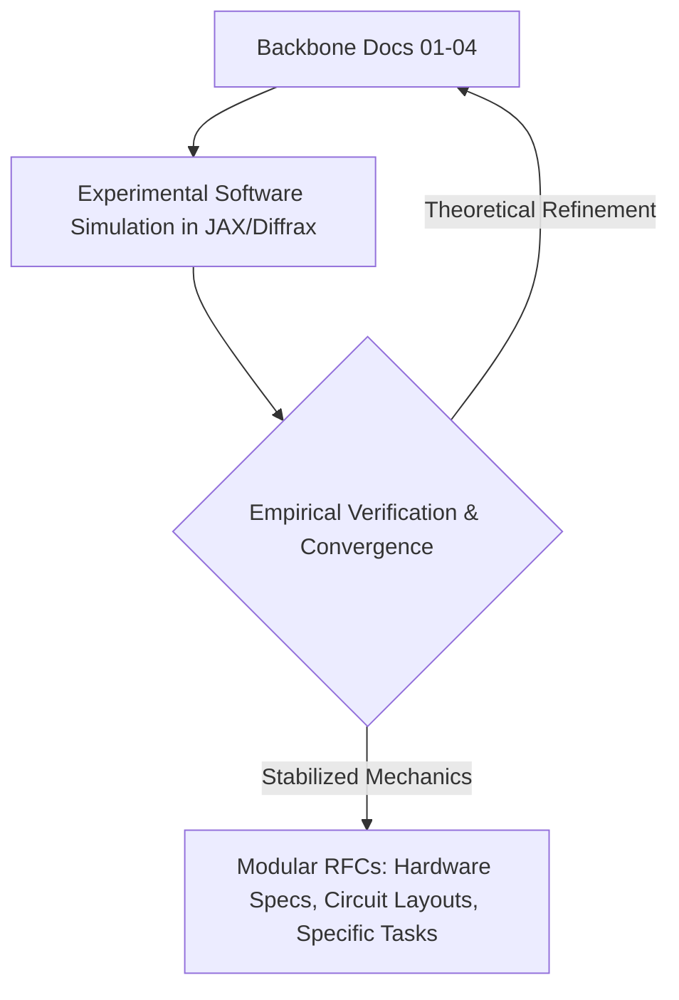

# Physical Language Model (PhysLM / Project Resonon)
## Native Physics-Based Architecture Documentation Suite

This documentation suite establishes the foundational architecture for building a Language Model natively on physical principles, bypassing the digital Transformer paradigm (Matrix Multiplications, Self-Attention, Discrete Tokenization, and Global Backpropagation).

---

## Architectural Backbone

The architecture is founded on a **Triadic Physical Engine**:
1. **Quantum Hilbert Space for Representation:** Multi-layered continuous phase/amplitude encoding replacing discrete token IDs.
2. **Non-linear Wave Dynamics for Evolution:** Physical wave dispersion and cavity resonance replacing $O(N^2)$ Self-Attention mechanisms.
3. **Thermodynamics & Dissipative Mechanics for Optimization & Sampling:** Free energy minimization and physical Johnson-Nyquist thermal noise replacing digital softmax and backpropagation.

---

## Documentation Structure

```
docs/
├── README.md                      # Master Navigation & Document Lifecycle
├── backbone/                      # Foundational Architecture (Ground Truth)
│   ├── README.md                  # Backbone Navigation Index
│   ├── 01_VISION_AND_GRAND_ARCHITECTURE.md
│   ├── 02_MATHEMATICAL_AND_PHYSICAL_FORMULATION.md
│   ├── 03_SOFTWARE_SIMULATION_SPECIFICATION.md
│   └── 04_HARDWARE_ROADMAP_AND_MAPPING.md
├── rfcs/                          # Modular RFCs (Subsystems & Specifications)
└── benchmarks/                    # Simulation Results & Physical Verification
    ├── 01_PHYSICAL_AND_NUMERICAL_BENCHMARK_SUITE.md
    └── 02_PHASE0_EMPIRICAL_BASELINE_RESULTS.md
```

---

## Architectural Backbone

The foundational architecture is documented in [`docs/backbone/`](file:///c:/Users/Lenovo/Documents/projects/mesosfer/llm/docs/backbone/README.md):

| Document | Title | Description |
| :--- | :--- | :--- |
| **[Doc 01](file:///c:/Users/Lenovo/Documents/projects/mesosfer/llm/docs/backbone/01_VISION_AND_GRAND_ARCHITECTURE.md)** | **Vision & Grand Architecture** | High-level paradigm shift, why Transformers are silicon artifacts, system topology, and the 3-tiered learning hierarchy. |
| **[Doc 02](file:///c:/Users/Lenovo/Documents/projects/mesosfer/llm/docs/backbone/02_MATHEMATICAL_AND_PHYSICAL_FORMULATION.md)** | **Mathematical & Physical Formulation** | Rigorous mathematical equations, Hilbert state representations, Non-linear Schrödinger/Ginzburg-Landau dynamics, and action principles. |
| **[Doc 03](file:///c:/Users/Lenovo/Documents/projects/mesosfer/llm/docs/backbone/03_SOFTWARE_SIMULATION_SPECIFICATION.md)** | **Software Simulation Specification** | Computational architecture using JAX and Diffrax, numerical symplectic integrators, and PyTorch compatibility bridge. |
| **[Doc 04](file:///c:/Users/Lenovo/Documents/projects/mesosfer/llm/docs/backbone/04_HARDWARE_ROADMAP_AND_MAPPING.md)** | **Hardware Mapping & Phased Roadmap** | Phased trajectory from software ODE/SDE solvers to Analog CMOS, Mid-Term Tri-Substrate Hybrids, and Long-Term All-Photonic architectures. |

---

## Governance and RFC Lifecycle



As specified in the architectural alignment:
- The **4 Backbone Documents** serve as the ground truth principles.
- **Modular RFCs (Request for Comments)** will only be branched once the numerical simulation stabilizes empirical learning dynamics, preventing premature churn and architectural thrashing.
