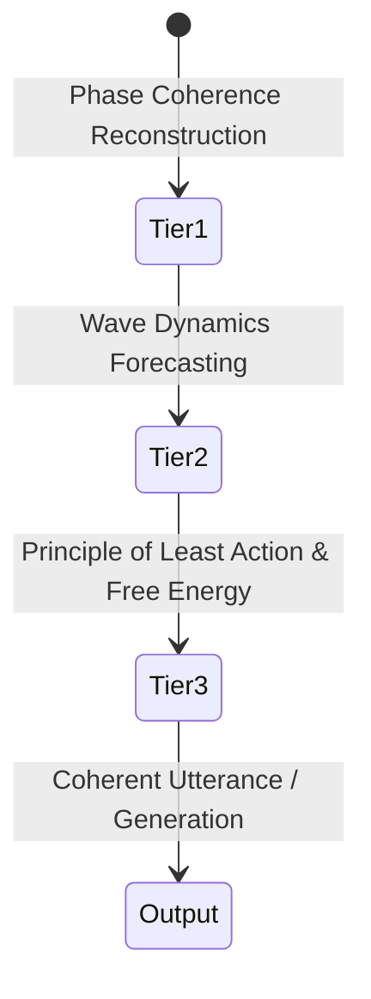

# 01 - Vision & Grand Architecture
## Native Physics-Based Language Modeling (PhysLM)

---

## 1. Executive Problem: The Transformer as a Hardware Artifact

Modern Large Language Models (LLMs) rely universally on the **Transformer architecture** (Vaswani et al., 2017). Despite their empirical success, Transformers suffer from fundamental structural inefficiencies:

1. **Quadratic Scaling & The Memory Wall:** Self-Attention scales as $\mathcal{O}(N^2)$ in context length. The resulting Key-Value (KV) cache causes extreme memory bandwidth exhaustion (*Von Neumann bottleneck*), turning inference into an I/O transfer crisis rather than a compute problem.
2. **Artificial Token Discretization:** Splitting continuous human language into discrete token identifiers (Byte-Pair Encoding) introduces arbitrary boundary artifacts, hallucinations, and multi-lingual representation distortion.
3. **Physical Illegality of Backpropagation:** Training requires reverse computation graphs across thousands of layers (*weight transport problem*), demanding megawatts of electrical power for floating-point tensor multiplications on GPUs.

> [!NOTE]
> The Transformer is **not** the optimal natural representation of language; it is an engineering compromise designed specifically because modern digital GPUs excel at dense 2D matrix multiplication (`GEMM`).

Human language is intrinsically continuous, associative, rhythmic, and contextual. By rebuilding the language model from the ground up using **fundamental physical mechanics**, we replace synthetic matrix simulations with real physical equilibria.

---

## 2. The Triadic Physical Engine

The architecture decomposes language computation into three interconnected physical domains:

```mermaid
graph TD
    subgraph "1. Quantum Hilbert Space"
        A[Raw Acoustic/Text Signal] --> B[Harmonic Oscillator Modes]
        B --> C[Complex State Vector: |psi⟩]
    end

    subgraph "2. Wave Dynamics Engine"
        C --> D[Unitary Wave Evolution: iħ dψ/dt]
        D --> E[Cavity Interference & Dispersion]
        E --> F[Continuous Phase-Space Context Trajectory]
    end

    subgraph "3. Thermodynamic Engine"
        F --> G[Free Energy Minimization: F = U - TS]
        G --> H[Langevin Thermal Fluctuation / Noise]
        H --> I[Physical Ground State / Stable Language Attractor]
    end
```

### Domain 1: Quantum Mechanics (Representation)
* **Principle:** Semantic states do not exist as static, isolated integers. They exist as **superpositions of eigenstates in a complex Hilbert space ($\mathcal{H}$)**.
* **Mechanism:** Rather than discrete vectors, words and concepts are described by state vectors $|\psi\rangle$ with complex amplitude (saliency) and phase (contextual binding/relational geometry).

### Domain 2: Wave Mechanics (Evolution & Context)
* **Principle:** Contextual accumulation is not computed via pairwise dot-products ($Q \times K^T$). Instead, context evolves naturally through **wave interference and resonance**.
* **Mechanism:** The system acts as a non-linear continuous physical reservoir. Information inputs create wave packets that propagate, scatter, and interfere. History is stored natively in the fading phase memory and standing-wave patterns of the physical medium.

### Domain 3: Thermodynamics & Statistical Mechanics (Optimization & Generation)
* **Principle:** Language generation is a physical relaxation toward minimum free energy ($F = \langle H \rangle - TS$).
* **Mechanism:** "Sampling" is not a software floating-point calculation of softmax distributions. Instead, physical thermal noise (e.g., Johnson-Nyquist noise in sirkuit analog) perturbs the system state, allowing it to spontaneously settle into stable valleys of an energy landscape (*attractor dynamics*).

---

## 3. The Layered Representation Pipeline

To interface human communication with the Hilbert state without conventional BPE tokenizers:

```mermaid
flowchart LR
    In[Raw Input Signal] --> L1[Layer 1: Continuous Waveform Encoding]
    L1 --> L2[Layer 2: Harmonic Oscillator Mode Quantization]
    L2 --> L3[Layer 3: Projective Hilbert Space Projection]
    L3 --> State[State Vector |ψ⟩ in H]
```

1. **Layer 1: Continuous Waveform Encoding:**
   Input text/speech is parsed into a continuous spectral signal $s(t)$ via frequency and phase modulation (Fourier/wavelet envelope). There is **no discrete vocabulary lookup table**.
2. **Layer 2: Harmonic Oscillator Modes:**
   The spectral signal excites quantized vibrational modes of coupled harmonic oscillators, capturing grammatical rhythm, syllable cadence, and syntactic structure.
3. **Layer 3: Projective Complex Hilbert Space:**
   Oscillator excitations are mapped onto the state vector $|\psi\rangle = \sum_k c_k |e_k\rangle$, where $c_k \in \mathbb{C}$. 
   * Modulus $|c_k|$ represents semantic activation/presence.
   * Argument $\arg(c_k)$ represents relative phase alignment and contextual relationship.

---

## 4. The 3-Tiered Learning Hierarchy

Transformers optimize a single naive metric: *Cross-Entropy loss on next-token prediction*. PhysLM implements a **3-tiered physical learning hierarchy**:



1. **Tier 1: Phase Coherence Reconstruction (Representation Grounding):**
   The model learns to preserve and reconstruct phase coherence across masked or noisy inputs. This forces the physical medium to encode meaningful semantic topology rather than raw noise.
2. **Tier 2: Wave Dynamics Forecasting (Temporal Continuity):**
   The model learns the equations of motion ($d|\psi\rangle/dt = -i\hat{H}|\psi\rangle$) to predict how semantic wave packets propagate through time, ensuring grammatical coherence without attention masks.
3. **Tier 3: Principle of Least Action & Free Energy Minimization (Reasoning & Grounding):**
   Higher-order reasoning operates by minimizing action $S = \int L \, dt$ and variational free energy $\mathcal{F}$. Sensible, logical reasoning corresponds to the path of stationary action in the semantic energy landscape.

---

## 5. Architectural Comparison

| Dimension | Digital Transformer (Llama / GPT) | Physical Language Model (PhysLM) |
| :--- | :--- | :--- |
| **Foundational Substrate** | Boolean logic, digital ALU, floating-point units | Continuous fields, analog waves, thermal reservoirs |
| **Basic Information Unit** | Discrete Token ID ($x \in \{0, \dots, V-1\}$) | Complex State Vector in Hilbert Space ($|\psi\rangle \in \mathcal{H}$) |
| **Contextual Memory** | KV Cache in DRAM ($\mathcal{O}(N^2)$ memory bound) | Standing wave patterns & physical phase memory ($\mathcal{O}(1)$ space) |
| **Attention Mechanism** | $\text{Softmax}(QK^T / \sqrt{d})V$ matrix multiplication | Physical wave interference & resonator dispersion |
| **Generative Sampling** | Synthetic Softmax + Temperature formula | Physical thermal fluctuation (Boltzmann distribution) |
| **Training Scheme** | Global Backpropagation (reverse computational graph) | Equilibrium Propagation / Local Hebbian Hamiltonian updates |
| **Power Consumption** | Hundreds of Watts per chip (Megawatts per cluster) | Tens of Watts total (Biological efficiency range) |
