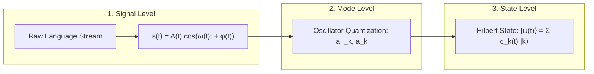
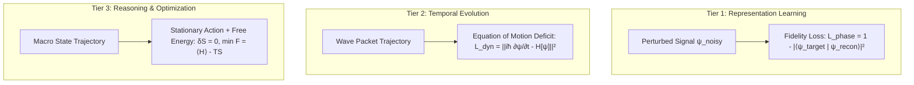

# 02 - Mathematical & Physical Formulation
## Rigorous Foundations of the Triadic Physical Engine

---

## 1. Multi-Layered Semantic State Representation

Unlike discrete language models that embed tokens into static Euclidean vectors $v \in \mathbb{R}^d$, PhysLM encodes information as dynamic states residing in a complex projective Hilbert space $\mathcal{H}$.

### 1.1 Layer 1: Continuous Waveform Encoding
Any input sequence of characters, phonemes, or acoustic waveforms is represented as an analog continuous signal $s(t)$ via continuous basis wavelets:
$$s(t) = \int_{-\infty}^{\infty} \mathcal{W}(a, b) \frac{1}{\sqrt{|a|}} \phi\left(\frac{t - b}{a}\right) da \, db$$
where $\phi(t)$ is a mother wavelet (e.g., Morlet/Gabor wavelet) establishing localized phase $\phi(t)$ and frequency $\omega(t)$ envelopes without requiring discrete boundaries.

### 1.2 Layer 2: Harmonic Oscillator Mode Quantization
The signal $s(t)$ couples to a physical bank of $K$ coupled harmonic oscillators. In second quantization:
$$\hat{H}_{\text{osc}} = \sum_{k=1}^K \hbar \omega_k \left( \hat{a}_k^\dagger \hat{a}_k + \frac{1}{2} \right) + \sum_{j \neq k} J_{jk} \left( \hat{a}_j^\dagger \hat{a}_k + \hat{a}_k^\dagger \hat{a}_j \right)$$
* $\hat{a}_k^\dagger, \hat{a}_k$: Creation and annihilation operators for vibrational mode $k$.
* $\omega_k$: Characteristic resonance frequency corresponding to linguistic rhythms (phonology, syntax).
* $J_{jk}$: Coupling matrix mediating harmonic resonance between modes.

### 1.3 Layer 3: Complex Projective Hilbert Space Projection
The excitation across all $K$ modes forms the state vector $|\psi(t)\rangle \in \mathcal{H}$:
$$|\psi(t)\rangle = \sum_{k=1}^K c_k(t) |k\rangle, \quad c_k(t) = \rho_k(t) e^{i \theta_k(t)}, \quad \sum_{k=1}^K |c_k(t)|^2 = 1$$
* **Magnitude $\rho_k(t) = |c_k(t)| \in [0, 1]$:** Represents the **activation saliency** of concept/feature $k$.
* **Phase $\theta_k(t) = \arg(c_k(t)) \in [-\pi, \pi)$:** Represents the **relational binding angle**. Two concepts with phase alignment $\Delta \theta \approx 0$ interfere constructively (syntactically or semantically bound), whereas orthogonal phases $\Delta \theta \approx \pi/2$ remain uncoupled.

---

## 2. Dynamic Wave Evolution (Continuous Context Engine)

Instead of the quadratic Transformer Self-Attention matrix $A = \text{softmax}(QK^T/\sqrt{d})V$, PhysLM propagates context via the **Non-linear Complex Ginzburg-Landau / Gross-Pitaevskii Equation (NLSE)**:

$$i \hbar \frac{\partial \psi(\mathbf{x}, t)}{\partial t} = \left[ -\frac{\hbar^2}{2m} \nabla^2 + V(\mathbf{x}, t) + g |\psi(\mathbf{x}, t)|^2 - i \gamma \right] \psi(\mathbf{x}, t) + \xi(\mathbf{x}, t)$$

### Physical Decomposition of Terms

| Term | Mathematical Expression | Physical Meaning in Language Modeling |
| :--- | :--- | :--- |
| **Kinetic / Dispersion** | $-\frac{\hbar^2}{2m} \nabla^2 \psi$ | Spatiotemporal propagation of information across the context window (spreading of ideas). |
| **Attractor Potential** | $V(\mathbf{x}, t) \psi$ | The learned semantic topology (Hopfield-like valleys representing grammar and facts). |
| **Non-linear Interaction** | $g |\psi|^2 \psi$ | Self-modulation and semantic cross-talk (concepts binding together non-linearly). |
| **Dissipative Damping** | $-i \gamma \psi$ | Context fading memory; guarantees stability and prevents runaway energy divergences. |
| **Stochastic Driving** | $\xi(\mathbf{x}, t)$ | Thermal noise input driving creative variation during generation. |

### The Potential Landscape as an Associative Memory (Continuous Hopfield)
The potential energy field $V(\mathbf{x})$ acts as the continuous associative memory:
$$V(\mathbf{x}) = -\sum_{\mu=1}^M \exp\left( -\frac{\|\mathbf{x} - \mathbf{x}_\mu\|^2}{2 \sigma^2} \right)$$
where each $\mathbf{x}_\mu$ is a learned semantic attractor (a grammatical rule, a factual relation, or a canonical lexical prototype). Wave packets naturally gravitate and settle into these potential wells.

---

## 3. The 3-Tiered Learning Hierarchy

### Tier 1: Phase Coherence Reconstruction Loss
To establish meaningful coordinates in Hilbert space, the model learns by restoring masked or noisy phases:
$$\mathcal{L}_{\text{phase}} = 1 - \left| \langle \psi_{\text{target}} | \psi_{\text{recon}} \rangle \right|^2 = 1 - \left| \int \psi_{\text{target}}^*(\mathbf{x}) \psi_{\text{recon}}(\mathbf{x}) d\mathbf{x} \right|^2$$
This quantum fidelity metric ensures both magnitude (content) and phase (structural coherence) are preserved without requiring categorical cross-entropy.

### Tier 2: Dynamical Consistency (Wave Equation Deficit)
The model's internal parameterization of $\hat{H}$ must faithfully govern physical evolution over time:
$$\mathcal{L}_{\text{dyn}} = \int_0^T \left\| i \hbar \frac{\partial \psi}{\partial t} - \left( \hat{H}_{\text{eff}}[\psi] \right) \right\|_{\mathcal{H}}^2 dt$$
This guarantees that time evolution is continuous, deterministic, and stable under perturbation.

### Tier 3: Principle of Least Action & Free Energy Minimization
Higher-level reasoning converges via variational optimization of the field action $S$:
$$S[\psi] = \int dt \int d\mathbf{x} \, \mathcal{L}_{\text{field}}\left(\psi, \nabla \psi, \frac{\partial \psi}{\partial t}\right)$$
$$\mathcal{L}_{\text{field}} = \frac{i \hbar}{2} \left( \psi^* \frac{\partial \psi}{\partial t} - \psi \frac{\partial \psi^*}{\partial t} \right) - \frac{\hbar^2}{2m} |\nabla \psi|^2 - V(\mathbf{x})|\psi|^2 - \frac{g}{2}|\psi|^4$$

For stationary generation, the system minimizes Variational Free Energy:
$$\mathcal{F}[\rho] = \text{Tr}(\hat{\rho} \hat{H}) - T_{\text{phys}} \mathcal{S}_{\text{von Neumann}}(\hat{\rho})$$
where $\mathcal{S}(\hat{\rho}) = -k_B \text{Tr}(\hat{\rho} \ln \hat{\rho})$. Language generation is the physical decay of high-energy excitation into the lowest free energy state consistent with the boundary conditions (the prompt).

---

## 4. Parameter Adaptation Without Backpropagation (Equilibrium Propagation)

Global backpropagation requires storing intermediate activation tensors across time, scaling linearly with context length. PhysLM updates internal couplings $W_{jk}$ via **Equilibrium Propagation (Scellier & Bengio, 2017)**:

1. **Free Phase (Relaxation):** The input prompt boundary is clamped; the internal wave state settles into a free equilibrium state $\psi^0$ with energy $E(\psi^0)$.
2. **Nudged Phase (Weak Clamping):** A weak nudge of the target output is applied at the boundary; the system relaxes into a nudged equilibrium $\psi^\beta$ under energy $E(\psi^\beta) + \beta \mathcal{C}$, where $\beta$ is a small perturbation coefficient and $\mathcal{C}$ is the boundary cost.
3. **Local Parameter Update:**
$$\Delta W_{jk} = -\frac{\eta}{\beta} \left( \frac{\partial E(\psi^\beta)}{\partial W_{jk}} - \frac{\partial E(\psi^0)}{\partial W_{jk}} \right)$$

> [!IMPORTANT]
> The derivative $\frac{\partial E}{\partial W_{jk}}$ is strictly **local** to component $j$ and $k$. It does not require transporting gradients backwards through a computational graph, enabling execution directly on physical analog substrates.
