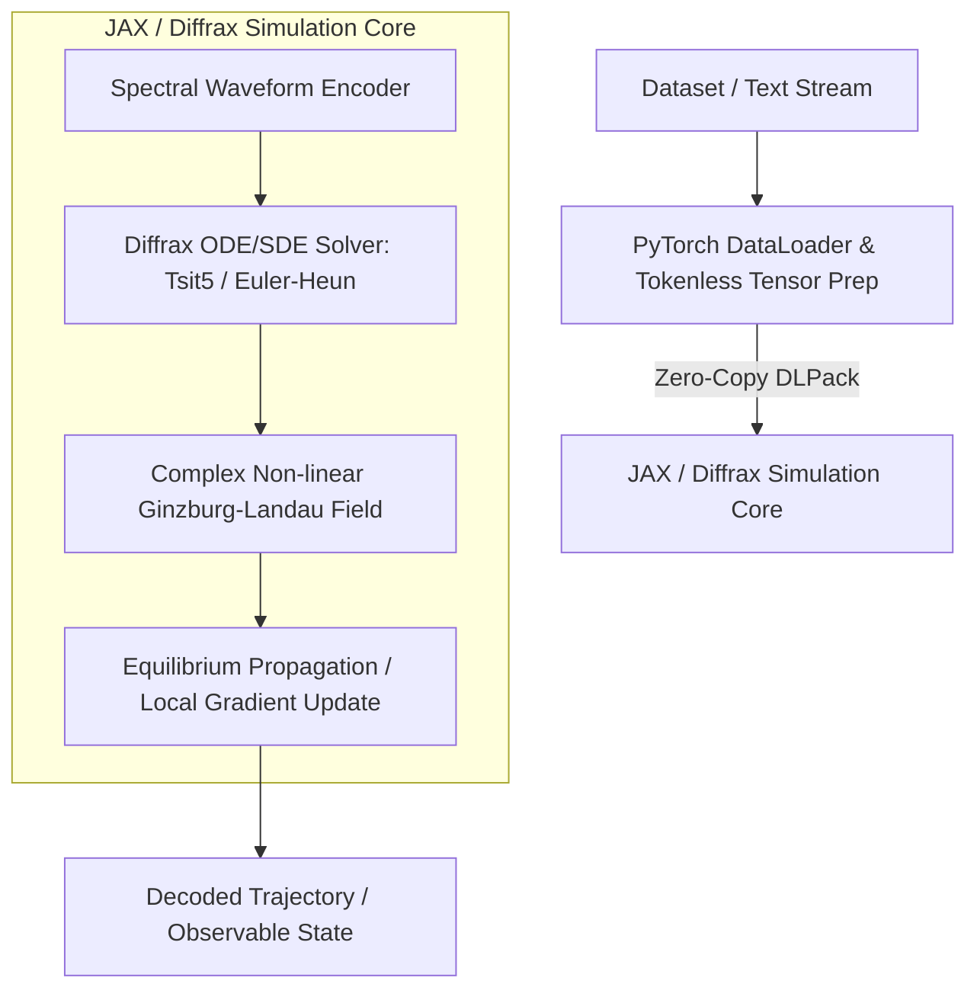

# 03 - Software Simulation Specification
## Numerical Simulation Architecture in JAX & Diffrax with PyTorch Bridge

---

## 1. Stack Rationale & Architecture

To evaluate physical language modeling before physical hardware fabrication, the equations of motion must be simulated on digital computers. 

* **Primary Engine: JAX & Diffrax:**
  * **Native Complex Number Support:** First-class complex autodiff and linear algebra (`jnp.complex64`, `jnp.complex128`).
  * **Differentiable ODE/SDE Solvers:** Diffrax provides adaptive-step Runge-Kutta, Symplectic, and stochastic Brownian path solvers with `vmap` vectorization.
  * **XLA Compilation:** Just-In-Time (`jax.jit`) compilation directly to GPU/TPU kernels.
* **Secondary Layer: PyTorch Compatibility Bridge:**
  * Zero-copy DLPack / NumPy exchange to plug into existing HuggingFace dataset tokenizers, evaluation pipelines, and training loaders.



---

## 2. Numerical State Representation

The physical field is discretized across a 1D or 2D spatial grid representing latent semantic dimensions:

```python
import jax
import jax.numpy as jnp
from typing import NamedTuple

class FieldState(NamedTuple):
    psi: jax.Array        # Shape: (N_grid,), dtype: complex64
    potential: jax.Array  # Shape: (N_grid,), dtype: float32 (Attractor wells)
    temperature: float    # Physical noise parameter T
```

### Grid Discretization & Operators
Spatial derivatives $\nabla^2 \psi$ are computed using second-order central finite differences or Fast Fourier Transform (FFT) spectral methods:
$$\nabla^2 \psi_j \approx \frac{\psi_{j+1} - 2\psi_j + \psi_{j-1}}{\Delta x^2}$$
Or in Fourier space:
$$\mathcal{F}\{\nabla^2 \psi\} = -k^2 \mathcal{F}\{\psi\}$$

---

## 3. Minimal Runnable Simulation Specification (JAX + Diffrax)

The following self-contained pattern demonstrates numerical integration of the Non-linear Schrödinger Wave equation using Diffrax:

```python
"""
ponytail: Minimal self-contained prototype of Non-linear Wave Language Field in JAX.
Simulates wave packet propagation through an attractor potential well.
"""
import jax
import jax.numpy as jnp
import diffrax

def laplacian_1d(psi: jnp.ndarray, dx: float) -> jnp.ndarray:
    """Spectral or central-difference kinetic energy operator."""
    return (jnp.roll(psi, -1) - 2 * psi + jnp.roll(psi, 1)) / (dx ** 2)

def wave_field_drift(t, state: jnp.ndarray, args):
    """
    Computes d(psi)/dt = -i/hbar * [ -hbar^2/(2m) * Lap(psi) + V*psi + g*|psi|^2*psi - i*gamma*psi ]
    """
    dx, hbar, mass, g, gamma, potential = args
    kinetic = -(hbar ** 2) / (2.0 * mass) * laplacian_1d(state, dx)
    nonlinear = g * (jnp.abs(state) ** 2) * state
    dissipation = -1j * gamma * state
    
    hamiltonian_action = kinetic + potential * state + nonlinear + dissipation
    dpsi_dt = -1j / hbar * hamiltonian_action
    return dpsi_dt

def step_wave_simulation(
    initial_psi: jnp.ndarray,
    potential: jnp.ndarray,
    t0: float = 0.0,
    t1: float = 1.0,
    dt: float = 0.01,
    dx: float = 0.1,
    g: float = 0.5,
    gamma: float = 0.05
):
    args = (dx, 1.0, 1.0, g, gamma, potential)
    term = diffrax.ODETerm(wave_field_drift)
    solver = diffrax.Tsit5()  # Adaptive Runge-Kutta 5(4)
    saveat = diffrax.SaveAt(ts=jnp.linspace(t0, t1, 50))
    
    sol = diffrax.diffeqsolve(
        term,
        solver,
        t0=t0,
        t1=t1,
        dt0=dt,
        y0=initial_psi,
        args=args,
        saveat=saveat,
        stepsize_controller=diffrax.PIDController(rtol=1e-4, atol=1e-6)
    )
    return sol.ys  # Trajectory over time
```

---

## 4. PyTorch Compatibility Bridge

To maintain seamless interoperability with PyTorch data loaders without GPU-CPU transfer latency, we employ the DLPack protocol (`torch.utils.dlpack` and `jax.dlpack`):

```python
import torch
from torch.utils.dlpack import to_dlpack, from_dlpack
import jax.dlpack

def torch_to_jax(tensor: torch.Tensor) -> jax.Array:
    """Zero-copy tensor conversion from PyTorch GPU to JAX GPU."""
    return jax.dlpack.from_dlpack(to_dlpack(tensor))

def jax_to_torch(array: jax.Array) -> torch.Tensor:
    """Zero-copy array conversion from JAX GPU to PyTorch GPU."""
    return from_dlpack(jax.dlpack.to_dlpack(array))
```

### Bridge Design Pattern
1. **Input Batching (PyTorch):** Handles dataset streaming, raw text reading, and audio/character normalization.
2. **Execution Core (JAX):** Executes the complex differential equation solvers and computes phase-overlap fidelity metrics.
3. **Evaluation Metrics (PyTorch/HuggingFace):** Output observables (expectation values $\langle \psi | \hat{O} | \psi \rangle$) are converted back to PyTorch for downstream NLP benchmark scoring (e.g., perplexity, retrieval fidelity).

---

## 5. Verification & Benchmark Suite

The software simulation must be verified against three baseline stability tests:

1. **Unitary Norm Conservation Test:**
   Under $\gamma = 0$ (zero dissipation) and $\xi = 0$, verify that total probability norm $\int |\psi(x,t)|^2 dx = 1.0$ is conserved to within machine precision ($\Delta N < 10^{-5}$).
2. **Attractor Trapping Test:**
   A wave packet initialized near a potential well $V(x_0)$ must settle into the well as $t \to \infty$ under finite damping $\gamma > 0$.
3. **Soliton Formation & Non-linear Stability Test:**
   Verify that attractive non-linearity ($g < 0$) produces self-reinforcing localized wave packets (solitons) representing persistent concept representations.
