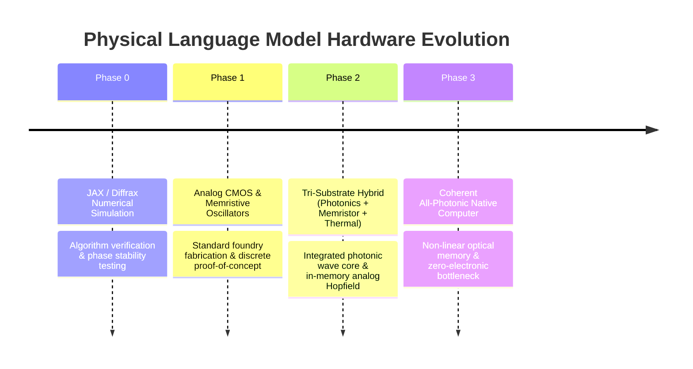

# 04 - Hardware Roadmap & Physical Mapping
## Physical Substrate Realization and Phased Implementation Roadmap

---

## 1. Physical Mapping: From Math to Matter

The mathematical formulation maps directly onto distinct physical phenomena and solid-state materials:

```mermaid
flowchart LR
    subgraph Mathematical_Domain
        M1[Hilbert State |ψ⟩]
        M2[Wave Interference & Dispersion]
        M3[Attractor Potential V]
        M4[Thermal Sampling & Relaxation]
    end

    subgraph Physical_Substrate
        P1[Optical Coherent Laser Amplitude & Phase]
        P2[Silicon Photonic Waveguide / Resonator Cavity]
        P3[Memristor Crossbar Conductance Arrays]
        P4[Analog Johnson-Nyquist Thermal Noise Circuit]
    end

    M1 -.-> P1
    M2 -.-> P2
    M3 -.-> P3
    M4 -.-> P4
```

### Physical Component Breakdown

1. **Wave Propagation Substrate (Silicon Photonics):**
   * **Mechanism:** Light traveling through micro-ring resonators and Mach-Zehnder Interferometers (MZIs).
   * **Function:** Computes continuous phase modulation, dispersion, and wave interference with zero active switching power and picosecond latency.
2. **Associative Potential Wells (Memristor / ReRAM Crossbars):**
   * **Mechanism:** Variable non-volatile resistive states ($G_{ij}$) in transition metal oxides ($\text{TiO}_x, \text{HfO}_x$).
   * **Function:** Encodes the potential energy landscape $V(\mathbf{x})$. Input voltages naturally produce current flows following Ohm's and Kirchhoff's laws ($I = \sum V_j G_{jk}$), performing physical field contractions in-situ.
3. **Thermal Relaxation & Sampling Generator:**
   * **Mechanism:** Unamplified Johnson-Nyquist thermal voltage fluctuations in calibrated resistors ($S_v = 4 k_B T R$).
   * **Function:** Directly supplies the stochastic term $\xi(t)$, allowing the physical state to sample the Boltzmann distribution without algorithmic pseudo-random number generators.

---

## 2. Phased Hardware Roadmap

The hardware transition is structured into four disciplined milestones:



### Phase 0: Numerical Software Simulation (Months 0–6)
* **Substrate:** Digital GPU/TPU clusters running JAX + Diffrax.
* **Goal:** Prove learning convergence on benchmark language corpora using phase coherence reconstruction and equilibrium propagation.
* **Deliverable:** Open-source Python simulation package with validated scaling laws.

### Phase 1: Near-Term Analog CMOS Prototype (Months 6–18)
* **Substrate:** Standard CMOS mixed-signal integrated circuit with integrated memristor crossbars (e.g., TSMC 65nm/28nm CMOS + ReRAM backend).
* **Wave Dynamics Strategy:** Emulated continuous-time analog LC-oscillator circuits.
* **Advantage:** Low barrier to entry; uses established semiconductor supply chains.
* **Limitation:** Electronic parasitics limit wave frequency to the low gigahertz range.

### Phase 2: Mid-Term Tri-Substrate Hybrid (Target Milestone) (Months 18–36)
* **Substrate:** Multi-chip module (MCM) combining:
  1. Silicon Photonic Integrated Circuit (PIC) for passive, zero-heat wave interference.
  2. Electronic ReRAM crossbar for high-density Hopfield attractor potential storage.
  3. Analog thermal noise source for physical temperature sampling.
* **Performance:** Estimated $100\times$ throughput improvement and $1,000\times$ power reduction compared to Blackwell/Hopper GPU clusters.

### Phase 3: Long-Term All-Photonic Coherent Computer (Long-Term Horizon)
* **Substrate:** Monolithic non-linear optical crystal with photorefractive and optical bistability materials (e.g., Lithium Niobate on Insulator - LNOI).
* **Goal:** Eliminate optical-electronic-optical (OEO) conversions completely. Both wave evolution and attractor memory reside in coherent light fields.

---

## 3. Engineering Challenges & Mitigation Protocols

### Challenge 1: Analog Drift and Thermal Sensitivity
* **Problem:** Physical materials expand, contract, and alter their electrical conductance under ambient temperature shifts, degrading learned weights.
* **Mitigation:**
  * **Differential Signaling:** Encode weights as conductance differences ($G^+ - G^-$), canceling common-mode thermal drift.
  * **Active Thermal Stabilization:** On-chip Peltier micro-coolers maintaining the photonic die at a constant reference temperature ($\pm 0.05^\circ\text{C}$).

### Challenge 2: Precision & Dynamic Range Limits
* **Problem:** Analog sirkuit exhibits an effective signal-to-noise ratio (SNR) roughly equivalent to 6 to 8 bits of digital floating-point precision.
* **Mitigation:**
  * **Topological Error Robustness:** Unlike digital models where bit-flips cause catastrophic errors, wave and attractor dynamics are topologically stable: small perturbations simply cause the trajectory to slightly shift before falling into the same attractor basin.

### Challenge 3: I/O & Transduction Bottleneck
* **Problem:** Converting high-speed digital text streams into analog optical/voltage waveforms requires high-speed DAC/ADC converters, which consume power.
* **Mitigation:**
  * Direct continuous acoustic/optical sensor coupling. For text processing, perform DAC modulation once at the boundary of large context streams rather than at every internal layer.

```
ponytail: The initial Phase 1 CMOS prototype uses an LC-tank network to emulate wave mechanics.
Known ceiling: Parasitic capacitance restricts frequency to ~2 GHz.
Upgrade path: Migrate the wave propagation layer to Phase 2 Silicon Photonics (Pointers: LNOI waveguides).
```
