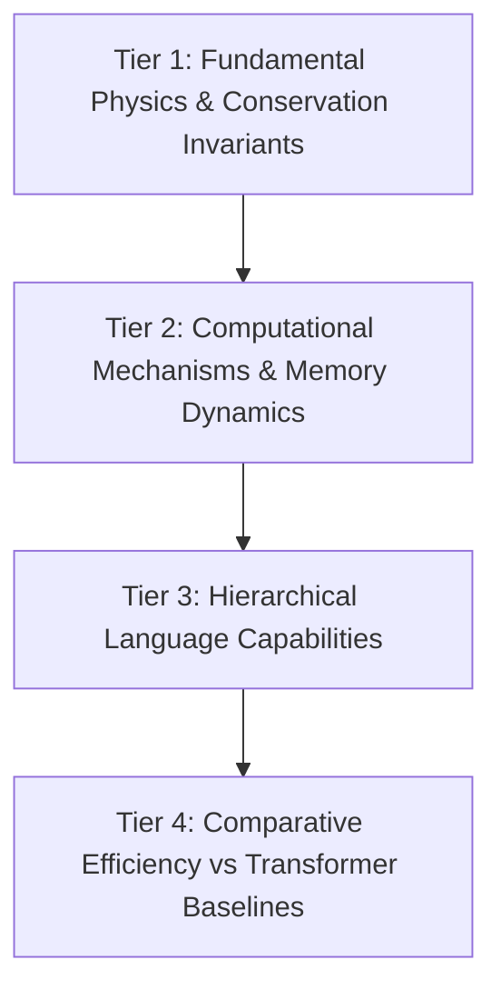
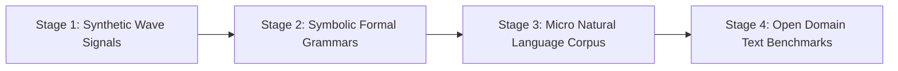
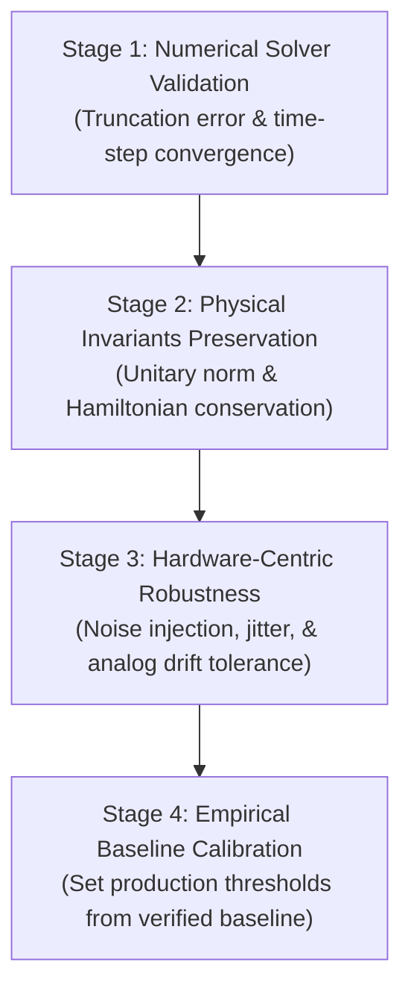

# 01 - Physical & Numerical Benchmark Suite
## Verification Standards, Acceptance Criteria, and Comparative Baselines

---

## 1. Executive Summary

This document formalizes the rigorous verification protocol for the Physical Language Model (**PhysLM** / Project Resonon). 

Before scaling to production workloads, any numerical implementation (such as the Phase 0 JAX/Diffrax simulator) must pass a **4-Tier Evaluation Hierarchy**:



---

## 2. Tier 1: Fundamental Physics & Invariant Checks

Tier 1 validates that the software simulation strictly preserves physical laws without numerical divergence or unphysical artifacts.

### 1.1 Norm Conservation Test (Unitary Invariance)
In the absence of dissipation ($\gamma = 0$) and thermal noise ($\xi = 0$), the total probability density must remain conserved across time:
$$N(t) = \int_{\Omega} |\psi(\mathbf{x}, t)|^2 d\mathbf{x} = 1.0$$
* **Acceptance Metric:** Absolute norm drift $\Delta N(t) = |N(t) - N(0)|$.
* **Target Threshold:** $\max_{t \in [0, T]} \Delta N(t) < 10^{-5}$ across $T = 100$ simulation steps.
* **Failure Mode:** Symplectic breakdown or non-unitary numerical instability in the ODE solver.

### 1.2 Hamiltonian Energy Conservation
Under isolated conditions ($H = T + V$, $\gamma = 0$), total system energy must remain constant:
$$E(t) = \int \left( \frac{\hbar^2}{2m} |\nabla \psi|^2 + V(\mathbf{x}) |\psi|^2 + \frac{g}{2} |\psi|^4 \right) d\mathbf{x}$$
* **Acceptance Metric:** Fractional energy error $\frac{|E(t) - E(0)|}{E(0)} < 10^{-4}$.

### 1.3 Soliton Propagation & Non-Linear Stability
Under attractive self-interaction ($g < 0$), localized wave packets must sustain stationary solitary wave propagation without dispersing:
* **Acceptance Metric:** Profile variance ratio $\frac{\text{Var}(|\psi(x, T)|^2)}{\text{Var}(|\psi(x, 0)|^2)} \in [0.98, 1.02]$.

---

## 3. Tier 2: Computational Mechanisms & Attractor Dynamics

Tier 2 evaluates the physical medium as an associative information processor.

### 2.1 Attractor Basin Trapping
Verify that a perturbed initial state $\psi(x, 0) = \psi_{\text{attractor}} + \epsilon$ settles into the global minimum of potential well $V(\mathbf{x})$ under dissipation $\gamma > 0$.
* **Primary Acceptance Metric (Loss Error):**
  $$\text{MSE}(\psi(\cdot, T_{\text{relax}}), \psi_{\text{attractor}}) = \frac{1}{|\Omega|} \int |\psi(x, T_{\text{relax}}) - \psi_{\text{attractor}}(x)|^2 dx < 10^{-3}$$

### 2.2 Equation of Motion Dynamical Deficit
Verify that the parameterized Hamiltonian field $\hat{H}_{\text{eff}}$ tracks empirical trajectory evolution:
$$\mathcal{L}_{\text{dyn}} = \frac{1}{T} \int_0^T \left\| i\hbar \frac{\partial \psi}{\partial t} - \hat{H}_{\text{eff}}[\psi] \right\|^2 dt < 10^{-3}$$

### 2.3 Equilibrium Propagation Relaxation Speed
Test local weight adjustment dynamics:
$$\Delta W_{jk} = -\frac{\eta}{\beta} \left( \frac{\partial E(\psi^\beta)}{\partial W_{jk}} - \frac{\partial E(\psi^0)}{\partial W_{jk}} \right)$$
* **Acceptance Metric:** Gradient alignment between equilibrium propagation updates and exact mathematical Jacobian:
  $$\cos\angle(\Delta W_{\text{EqProp}}, \nabla_W \mathcal{L}) > 0.95$$

---

## 4. Tier 3: Hierarchical Language Capabilities

Testing progresses along four disciplined complexity gates:



### Stage 1: Continuous Multi-Frequency Wave Reconstruction
* **Workload:** Superposition of $M$ harmonic carriers $s(t) = \sum_{m=1}^M A_m \cos(\omega_m t + \phi_m)$.
* **Task:** Phase-coherence reconstruction after masking a continuous temporal window $\Delta t$.
* **Target:** Reconstruction $\text{MSE} < 10^{-3}$ and phase correlation $R_{\phi} > 0.99$.

### Stage 2: Formal Grammar Resonance (Nested Dyck Languages)
* **Workload:** Nested parentheses strings (e.g., `[ [ ( { } ) ] ]`).
* **Test:** Can the physical wave cavity retain state depth without a discrete stack or position embedding table?
* **Mechanism:** Nested layers correspond to higher vibrational harmonics.
* **Target:** 100% syntax validity on recursive depths up to $D = 16$.

### Stage 3: Micro Language Corpus (Character/Phoneme Streams)
* **Workload:** Raw character streams from **TinyStories** and **WikiText-2** (converted into continuous spectral signals without BPE tokenizers).
* **Task:** Contextual waveform extrapolation (predicting the continuous semantic trajectory given a prompt).
* **Target:** Continuous semantic perplexity equivalent to $< 1.8$ bits/byte.

---

## 4. Tier 4: Multi-Architecture Comparative Landscape & Scaling Theory

Rather than a narrow "is this faster than a Transformer?" test, Tier 4 evaluates **where this physical computing paradigm sits in the broader landscape of AI architectures** and how it behaves as context scales toward long horizons ($N \to \infty$).

```mermaid
quadrantChart
    title Architectural Paradigm Landscape
    x-axis Discrete State (Digital) --> Continuous Field (Physical)
    y-axis Static Memory (Lookup/KV) --> Dynamic Attractor Memory
    quadrant-1 Native Physical AI (PhysLM)
    quadrant-2 Modern Hopfield / Energy Models
    quadrant-3 Transformers (Attention / KV Cache)
    quadrant-4 State Space Models (Mamba / S4)
    "Transformer (NanoGPT)": [0.15, 0.2]
    "Mamba (SSM)": [0.35, 0.45]
    "Neural ODE": [0.75, 0.4]
    "Continuous Hopfield": [0.65, 0.8]
    "PhysLM (Project Resonon)": [0.88, 0.88]
```

### 4.1 Comparative Architectural Taxonomy

| Paradigm | Exemplar Baseline | State Representation | Context Memory Scaling | Reasoning Horizon Stability |
| :--- | :--- | :--- | :--- | :--- |
| **Attention-Based** | **NanoGPT** (Reference) | Discrete token embeddings | $\mathcal{O}(N)$ dynamic KV cache (Memory Wall) | Subject to attention dispersion & context rot |
| **State-Space Model** | **Mamba / S4** | Discrete recurrent hidden state $h_t$ | $\mathcal{O}(1)$ compressed vector | Information loss through lossy linear compression |
| **Continuous Depth** | **Neural ODE** | Latent ODE trajectory $z(t)$ | $\mathcal{O}(1)$ integration trajectory | High numerical stiffness over long time horizons |
| **Associative Energy** | **Modern Hopfield** | Static energy minima landscape | $\mathcal{O}(d)$ pattern storage | Requires external projection and query mechanisms |
| **Physical Wave Engine** | **PhysLM** | Continuous Hilbert state $|\psi(t)\rangle$ | $\mathcal{O}(1)$ physical field & phase memory | **Attractor-grounded; topologically stable against drift** |

---

## 5. Scaling Theory: Long-Horizon Reasoning Stability

A dedicated dimension of evaluation is testing behavior as context length $N$ scales from $1\text{k} \to 32\text{k} \to 128\text{k}+$ horizons:

### 5.1 Semantic Attractor Drift Over Time
* **Metric:** Geodesic phase-drift angle $\Delta \Theta(t) = \arccos\left(\frac{|\langle \psi(0) | \psi(t) \rangle|}{\|\psi(0)\| \|\psi(t)\|}\right)$ along a multi-step deductive chain.
* **Test:** While digital autoregressive models suffer from exponential error accumulation (hallucination drift), the physical dissipative term ($\gamma$) and potential wells ($V(\mathbf{x})$) act as self-correcting restoring forces, bounding phase drift to a compact invariant manifold.

### 5.2 Thermodynamic Energy Scaling
* **Metric:** Total energy dissipated per reasoning step as a function of sequence length $N$:
  $$\mathcal{E}_{\text{PhysLM}}(N) \approx \text{const} \times N \quad \text{vs} \quad \mathcal{E}_{\text{Transformer}}(N) \propto N^2 \text{ or } N \log N$$
PhysLM breaks the memory wall by eliminating off-chip DRAM data transfers entirely during physical inference.

---

## 5. Hierarchical Acceptance Methodology

Rather than imposing arbitrary a priori numerical thresholds (e.g. rigid 1e-5 or 1e-3 values out of thin air), acceptance is evaluated via a **3-stage hierarchical ladder**. Pass/fail boundaries are calibrated empirically from baseline runs:



### Stage 1: Numerical Solver Validation (Prerequisite)
Verify that the integration engine itself (e.g. Diffrax Tsit5 / Symplectic integrator) is mathematically sound:
* **Order of Convergence:** Error must scale with step-size as $\mathcal{O}(\Delta t^p)$ where $p$ is the solver order.
* **Truncation Bounds:** Local truncation errors must remain bounded without exponential stiffness blowup.

### Stage 2: Physical Invariants Preservation (Mandatory Gate)
If physical laws fail, the entire foundational premise of the physical architecture is falsified:
* **Probability Norm Invariance:** Under zero dissipation, $|N(t) - 1.0| \to 0$.
* **Hamiltonian Invariance:** $\frac{dE}{dt} = 0$ for closed conservative sub-systems.

### Stage 3: Robustness & Noise Tolerance (Hardware Reality Check)
To prevent creating a model that is "theoretically beautiful on paper but fragile in silicon/optics":
* **Thermal Noise Injection:** Evaluate stability under added Gaussian/Langevin noise $\xi(t) \sim \mathcal{N}(0, \sigma_{\text{thermal}}^2)$.
* **Parameter Perturbation:** Introduce $\pm 5\%$ analog variance into the potential field $V(\mathbf{x})$ and coupling matrix $J_{jk}$. The semantic trajectory must remain topologically stable within the same attractor basin.

### Empirical Calibration Rule
> [!IMPORTANT]
> **No Arbitrary Thresholds:** Concrete pass/fail numerical bounds are extracted directly from the initial Phase 0 numerical baseline run. Once the baseline establishes the intrinsic numerical floor of the solver, tolerance windows are locked in for all subsequent iterations.
