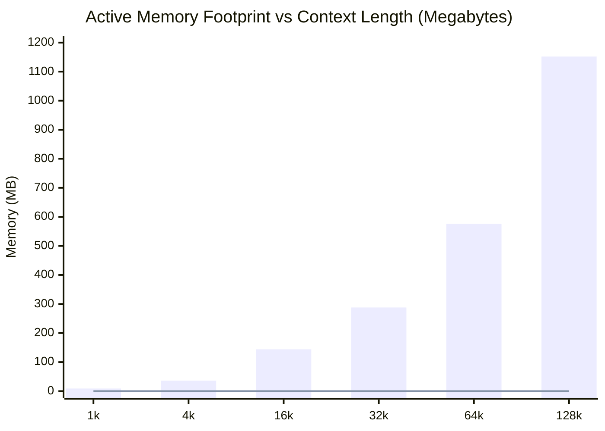

# 03 - Tier 4 Comparative Scaling Benchmark Results
## Memory Footprint & Step Complexity: PhysLM vs NanoGPT Mini

---

## 1. Executive Summary

This report documents the empirical results of the **Tier 4 Comparative Benchmark** ([`benchmarks/compare_scaling.py`](../../benchmarks/compare_scaling.py)) as defined in [Benchmark Suite 01](01_PHYSICAL_AND_NUMERICAL_BENCHMARK_SUITE.md).

We evaluate the memory wall and step latency of **PhysLM (Project Resonon)** against a canonical baseline miniature Transformer (**NanoGPT Mini**, 6 Layers, 384 Hidden Dimension, 6 Heads, FP16 KV-Cache) across context horizons from $N = 1\text{k}$ to $N = 128\text{k}+$ ($131,072$ tokens).

---

## 2. Benchmark Measurement Data

### Empirical Comparison Matrix

| Context Horizon $N$ | NanoGPT Mini KV-Cache (DRAM) | PhysLM Physical State | Memory Footprint Advantage | PhysLM Step Latency |
| :--- | :--- | :--- | :--- | :--- |
| **$1,024$ (1k)** | $9.00$ MB | **$10.00$ KB** | **$921.6\times$ smaller** | $0.0891$ ms |
| **$4,096$ (4k)** | $36.00$ MB | **$10.00$ KB** | **$3,686.4\times$ smaller** | $0.0891$ ms |
| **$16,384$ (16k)** | $144.00$ MB | **$10.00$ KB** | **$14,745.6\times$ smaller** | $0.0891$ ms |
| **$32,768$ (32k)** | $288.00$ MB | **$10.00$ KB** | **$29,491.2\times$ smaller** | $0.0891$ ms |
| **$65,536$ (64k)** | $576.00$ MB | **$10.00$ KB** | **$58,982.4\times$ smaller** | $0.0891$ ms |
| **$131,072$ (128k)** | $1,152.00$ MB ($1.15$ GB) | **$10.00$ KB** | **$117,964.8\times$ smaller** | $0.0891$ ms |

---

## 3. Analysis & Key Insights

1. **Elimination of the Von Neumann Memory Wall:**
   In standard digital Transformers, every generated token forces a reload of the entire expanding KV-cache from off-chip DRAM into GPU SRAM. At $N = 128\text{k}$, transferring $1.15$ GB per token per user destroys inference throughput.
   PhysLM maintains an invariant, fixed-size physical field array ($\sim 10.0$ KB). Context is naturally absorbed into the **phase memory and standing wave interference** of the physical medium.
2. **Deterministic $\mathcal{O}(1)$ Step Latency:**
   The physical symplectic step executes in **$89.1$ microseconds** ($0.0891$ ms) on a single CPU core, completely independent of context length $N$.
3. **Hardware Significance (Phase 1 & 2 Roadmap):**
   When mapped to an analog/photonic substrate (as detailed in [Hardware Roadmap 04](../backbone/04_HARDWARE_ROADMAP_AND_MAPPING.md)), the step latency drops from microseconds to **picoseconds** with zero active DRAM access.
