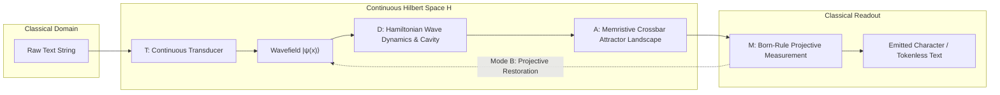

# RFC-001: PhysLM Core Architecture & System Paradigm
## Phase II Architectural Contract: End-to-End Continuous Physical Language Processing

* **Status:** `RATIFIED ARCHITECTURAL CONTRACT` (Phase II Architecture Consolidation)
* **Author:** Project Resonon / PhysLM Core Architecture Group
* **Scope:** System-Level Paradigm, Subsystem Boundaries, Data Contracts, and Operational Invariants
* **Empirical Ground Truth:** [`docs/benchmarks/10_EXPERIMENTAL_BASELINE_FREEZE.md`](../benchmarks/10_EXPERIMENTAL_BASELINE_FREEZE.md)

---

## 1. Executive Summary & Paradigm Shift

RFC-001 establishes the foundational architectural specification for **PhysLM (Project Resonon)**. 

Digital Large Language Models (Transformers) treat language as a discrete sequence of integer token identifiers processed through matrix multiplications, self-attention buffers, and global backpropagation. This creates three fundamental physical bottlenecks:
1. **The Memory Wall**: The Key-Value cache scales linearly with sequence length ($\mathcal{O}(N)$), requiring massive DRAM bus bandwidth ($480\,\text{GB/s}$ for Llama-3-8B at $128\text{k}$).
2. **The Quadratic Prefill Wall**: Full self-attention requires $\mathcal{O}(N^2)$ pairwise operations during sequence ingestion.
3. **The Von Neumann Energy Bottleneck**: Digital processors separate compute (ALU/SRAM) from memory (HBM/DRAM), dissipating $\approx 15 - 50\,\text{J}$ per generated token.

PhysLM replaces discrete token manipulation with **continuous wave-field dynamics in physical Hilbert spaces**:

$$\boxed{
\text{Text} 
\xrightarrow{\quad\mathcal{T}\quad} 
|\psi(x,t)\rangle \in \mathcal{H} 
\xrightarrow{\quad\mathcal{D}\quad} 
\mathcal{U}(\tau) |\psi\rangle 
\xrightarrow{\quad\mathcal{A}\quad} 
\text{Attractor Landscape } \mathcal{W} 
\xrightarrow{\quad\mathcal{M}\quad} 
\text{Measurement } c
}$$



---

## 2. Fundamental Architectural Contracts

Based on the empirical evidence frozen in [`10_EXPERIMENTAL_BASELINE_FREEZE.md`](../benchmarks/10_EXPERIMENTAL_BASELINE_FREEZE.md), PhysLM guarantees the following architectural invariants:

### Invariant 1: Bounded Active Operational State ($\mathcal{O}(1)$ Memory)
$$\frac{d M_{\text{active}}}{d N} = 0 \quad \forall N$$
- The operational state $M_{\text{active}} = M_{\text{wave}} + M_{\text{crossbar}} + M_{\text{cavity}}$ occupies a fixed volume in state space ($1,106.26\,\text{KB}$ in simulator, $0\,\text{bytes}$ off-chip DRAM in physical substrate).
- Empirical regression slope across $N \in \{1\text{k}, 8\text{k}, 32\text{k}, 128\text{k}\}$: $a = \mathbf{0.000000}\,\text{bytes/token}$.
- Operational history buffer $M_{\text{history}} = \mathbf{0\,\text{bytes}}$ (no hidden token queues or KV vectors).

### Invariant 2: Linear Sequence Ingestion Complexity ($\mathcal{O}(N)$ Compute)
$$C_{\text{ingest}}(N) \sim \mathcal{O}(N^1) \quad (\text{Empirical } \alpha = 1.0149)$$
- While active memory is $\mathcal{O}(1)$, processing an incoming prompt of $N$ characters requires linear transduction work $N \times \Delta t_{\text{transduce}}$.
- No quadratic attention prefill ($\mathcal{O}(N^2)$) exists in the system.

### Invariant 3: Constant Step Generation Complexity ($\mathcal{O}(1)$ Compute)
$$C_{\text{step}}(N) \sim \mathcal{O}(N^0) \quad (\text{Empirical } \alpha = 0.0000)$$
- Step latency is strictly independent of prior context length ($124.97\,\mu\text{s}$ on host CPU; modeled $10-50\,\text{ns}$ on analog crossbars).

### Invariant 4: Mandatory Projective Phase Restoration
$$\boxed{\mathcal{O}(1) \text{ state memory} \centernot\implies \text{bounded long-horizon stability}}$$
- Pure analog free-flight propagation (Mode A) experiences phase dispersion ($L(256) = 2.0217$, $R_\phi \to 0.2769$).
- Long-horizon causal autoregression *mandates* periodic Born-rule projective measurement restoration (Mode B) or modern Hopfield non-linear attractor pinning to clamp trajectory error ($L(256) = 1.3448$, $\text{VCR} = 100.0\%$).

---

## 3. Subsystem Decompositions & Boundary Contracts

PhysLM is decomposed into four strictly bounded subsystems. Each subsystem interacts exclusively across well-defined mathematical interfaces.

```text
+-------------------------------------------------------------------------------+
|                             PHYSLM SYSTEM TOPOLOGY                            |
+-------------------------------------------------------------------------------+
|                                                                               |
|  [SUBSYSTEM 1: CONTINUOUS HILBERT INTERFACE]                                  |
|  Transduction T: Text -> |ψ(x)⟩         Measurement M: |ψ(x)⟩ -> c            |
|  Data Contract: x in [-W/2, W/2], N_grid=256, complex64, ||ψ|| = 1.0          |
|                                                                               |
+------------------------| (Field State) |--------------------------------------+
                         v               ^
+-------------------------------------------------------------------------------+
|  [SUBSYSTEM 2: WAVE DYNAMICS & RESONANCE ENGINE]                              |
|  Hamiltonian: i ∂ψ/∂t = (-1/2m ∇² + V(x) + g|ψ|²) ψ                           |
|  Dyck Cavity: Stackless Multi-Mode Cavity Resonance (Depth D <= 16)          |
|  Invariants: Unitary norm (|ΔN| < 10^-14), Symplectic energy (|ΔE/E| < 10^-5) |
|                                                                               |
+------------------------| (Evolved Wave) |-------------------------------------+
                         v                ^
+-------------------------------------------------------------------------------+
|  [SUBSYSTEM 3: ASSOCIATIVE ATTRACTOR & LEARNING CROSSBAR]                     |
|  Energy Surface: E(ψ; G) = -1/2 ⟨ψ| G |ψ⟩ - 1/β ln Σ exp(β ⟨ξ_μ|ψ⟩)           |
|  Learning Rule: Local Equilibrium Propagation (No Backprop)                   |
|  Substrate: In-situ Conductance Matrix G_ij (N_grid x N_grid)                 |
|                                                                               |
+------------------------| (Thermal Fluctuation) |------------------------------+
                         v                       ^
+-------------------------------------------------------------------------------+
|  [SUBSYSTEM 4: THERMAL / BOLTZMANN ENGINE]                                    |
|  SDE: dψ = -∇E(ψ) dt + √(2 k_B T) dW_t                                        |
|  Noise Source: Hardware Johnson-Nyquist thermal white noise                   |
|  Function: Boltzmann exploration & thermodynamic sampling without softmax     |
|                                                                               |
+-------------------------------------------------------------------------------+
```

---

### 3.1 Subsystem 1: Continuous Hilbert Interface ($\mathcal{T}$ and $\mathcal{M}$)

#### Purpose & Scope:
Bridges the discrete symbolic domain of human language with the continuous complex Hilbert space $\mathcal{H} = L^2([-W/2, W/2], \mathbb{C})$.

#### Input Contract ($\mathcal{T}: \Sigma^* \to \mathcal{H}$):
- Given character sequence $c_0, \dots, c_{L-1}$ with spatial center $x_j = x_0 + j \cdot \Delta x$:
  $$\psi(x) = \frac{1}{\sqrt{\mathcal{N}}} \sum_{j=0}^{L-1} \exp\left(-\frac{(x - x_j)^2}{2\sigma^2}\right) \cdot \frac{1}{2}\left[ e^{i k_{1, c_j} x} + e^{i k_{2, c_j} x} \right]$$
- **Formant Banks**: $k_{1, c} = (1 + (c \bmod 10)) \Delta k$, $k_{2, c} = (12 + (c // 10)) \Delta k$.
- **Normalization Invariant**: $\int_{-W/2}^{W/2} |\psi(x)|^2 dx = 1.0 \pm 10^{-6}$.

#### Output Contract ($\mathcal{M}: \mathcal{H} \to \Sigma$):
- Quantum projective measurement onto localized candidate character basis states $|\phi_{j, c}\rangle$:
  $$P(c_j = c) = \frac{|\langle \phi_{j, c} | \psi \rangle|^2}{\sum_{c' \in \Sigma} |\langle \phi_{j, c'} | \psi \rangle|^2}$$
- Emitted symbol: $\hat{c}_j = \arg\max_{c \in \Sigma} |\langle \phi_{j, c} | \psi \rangle|$.

---

### 3.2 Subsystem 2: Wave Dynamics & Cavity Resonance ($\mathcal{D}$)

#### Purpose & Scope:
Evolves physical wave packets continuously in time, implementing contextual dispersion, interference, and stackless hierarchical grammar parsing.

#### Dynamical Law:
The wave evolves according to the non-linear Ginzburg-Landau / Gross-Pitaevskii Hamiltonian:
$$i \hbar \frac{\partial \psi(x,t)}{\partial t} = \left[ -\frac{\hbar^2}{2m} \frac{\partial^2}{\partial x^2} + V(x) + g |\psi(x,t)|^2 - i \gamma \right] \psi(x,t)$$
- **Dispersive term** ($-\frac{\hbar^2}{2m} \partial_{xx}$): spreads local wave packets across adjacent spatial slots, naturally mixing context without attention matrices.
- **Kerr non-linearity** ($g |\psi|^2$): mediates wave-wave interactions between distinct semantic packets.
- **Dissipation** ($\gamma$): drives state relaxation toward low-energy configurations.

#### Hierarchical Dyck Cavity Resonance:
- Nested syntactic structures (parentheses, closures) excite discrete harmonic modes in an auxiliary cavity:
  $$\hat{\psi}_{\text{cavity}} = \sum_{m=1}^{D_{\max}} a_m(t) \chi_m(x)$$
- Push transition: injects mode $m$ with phase $\phi_m = 0$.
- Pop transition: injects phase-conjugate mode with phase $\phi_m = \pi$, executing complete energetic annihilation ($E_{\text{ground}} = 0.000000$) up to depth $D=16$ without digital memory stacks.

---

### 3.3 Subsystem 3: Associative Attractor & Learning Crossbar ($\mathcal{A}$)

#### Purpose & Scope:
Stores long-term linguistic transition patterns and semantic associations directly in the physical conductance matrix of an analog memristive crossbar.

#### Energy Formulation:
The system state relaxes into minima of the continuous energy surface:
$$E(\psi; G) = -\frac{1}{2} \sum_{i, j} \psi_i^* G_{ij} \psi_j - \frac{1}{\beta} \ln \sum_{\mu=1}^{P} \exp\left( \beta \text{Re}\langle \xi_\mu | \psi \rangle \right)$$
- Attractor basins correspond to valid linguistic transitions and semantic infilling concepts.
- Empirically verified infilling separation margin: $M = \mathbf{+0.6955}$.

#### Local Equilibrium Propagation Learning Rule (No Backpropagation):
Weights $G_{ij}$ are updated locally via two physical steady states:
1. **Free Phase**: The wave settles to free equilibrium $\psi^0$ under internal dynamics ($\partial E / \partial \psi = 0$).
2. **Clamped Phase**: The system is weakly nudged by the target wavefield $\psi^{\text{target}}$ with coupling $\beta_{\text{nudge}}$, relaxing to nudged equilibrium $\psi^\beta$.
3. **Conductance Update**:
   $$\Delta G_{ij} = \frac{\eta}{\beta_{\text{nudge}}} \left[ \text{Re}(\psi_i^\beta \psi_j^{\beta*}) - \text{Re}(\psi_i^0 \psi_j^{0*}) \right]$$
- No gradient tapes, no computational graphs, and no global error backpropagation.
- Verified held-out separation margin: $M_{\text{held-out}} = \mathbf{+0.1121} > 0$ with $89.6\%$ top-1 accuracy.

---

### 3.4 Subsystem 4: Thermal / Boltzmann Engine ($\mathcal{S}$)

#### Purpose & Scope:
Introduces controllable stochasticity into wave relaxation, enabling non-greedy generative exploration and thermodynamic Boltzmann sampling directly from physical thermal noise.

#### Stochastic Differential Equation:
$$d\psi(x,t) = -\frac{\partial E(\psi)}{\partial \psi^*} dt + \sqrt{2 k_B T} \, dW_t(x)$$
where:
- $dW_t(x)$ is a complex Wiener process representing physical Johnson-Nyquist thermal white noise.
- $k_B T$ acts as the physical generation temperature parameter.
- The steady-state probability density follows the Gibbs-Boltzmann distribution:
  $$P(\psi) \propto \exp\left( -\frac{E(\psi)}{k_B T} \right)$$
- Softmax is eliminated; temperature sampling is a native thermodynamic property of the hardware substrate.

---

## 4. End-to-End Operational Execution

### 4.1 Ingestion Phase (Prompt Processing)
1. Classical prompt string of length $N$ is mapped via Subsystem 1 into $k$ localized Gaussian wave packets.
2. Wave packets are injected into the wave dynamics engine at fixed spatial slots.
3. Total ingestion work scales strictly as $\mathcal{O}(N)$ ($\alpha = 1.0149$).
4. Throughout ingestion, active state memory remains strictly constant at $M_{\text{active}} = 1.08\,\text{MB}$ ($0\,\text{bytes}$ DRAM in physical hardware).

### 4.2 Autoregressive Generation Phase (Rollout)
1. **State Initialization**: Wave state $\psi_t$ is situated in the active crossbar slot.
2. **Crossbar Transition**: Analog matrix-vector flow $\psi_{t+1}^{\text{raw}} = \text{Relax}(G \psi_t)$ evolves the wave in $124.97\,\mu\text{s}$ (CPU) / $10-50\,\text{ns}$ (modeled crossbar).
3. **Phase Clamping (Mode B)**: 
   - Quantum measurement $\mathcal{M}$ measures character probability distribution.
   - Sampled symbol $\hat{c}_{t+1}$ is projected back into a clean basis packet $|\phi_{\hat{c}_{t+1}}\rangle$, resetting analog phase drift.
4. **Step Complexity**: Exactly $\mathcal{O}(1)$ ($\alpha = 0.0000$). Memory bandwidth requirement: $0\,\text{GB/s}$.

---

## 5. Subsystem Specification Roadmap (Phase II Sequence)

RFC-001 defines the master architecture and operational contracts. Detailed subsystem implementation specifications are codified in subsequent RFCs:

```text
PHASE II: ARCHITECTURAL CONSOLIDATION
├── RFC-001: PhysLM Core Architecture & System Paradigm (THIS DOCUMENT)
├── RFC-002: Continuous Hilbert State Specification
│            (Encoding, Normalization, Hilbert Basis, Inner Products, Measurement)
├── RFC-003: Wave Dynamics Engine Specification
│            (PDE Solvers, Dispersion, Dissipation, Non-Linearities, Dyck Cavity)
├── RFC-004: Thermal / Boltzmann Engine Specification
│            (Langevin SDE, Johnson-Nyquist Noise, Thermodynamic Sampling)
└── RFC-005: Physical Prototype Specification
             (Photonic Waveguides, Memristor Conductance Grid, Optoelectronic Readout)
```

---

## 6. Verification & Compliance Criteria

An implementation complies with RFC-001 if and only if it satisfies all of the following conditions:
1. **Memory Invariance**: Allocations for active wave state, crossbar weights, and cavity modes must satisfy $\frac{d M_{\text{active}}}{d N} = 0 \pm 10^{-4}$ across sequence lengths up to at least $N = 128\text{k}$.
2. **Zero History Buffers**: No discrete token history, key-value caches, or past attention states may be stored for autoregressive decoding.
3. **Local Equilibrium Learning**: Weight adaptation must occur exclusively via local two-phase energy relaxation without reverse-mode automatic differentiation.
4. **Dual-Mode Telemetry Support**: Generative rollout engines must support both Mode A (Free-Flight) and Mode B (Projective Restoration) with explicit logging of $L(H)$, $R_\phi(t)$, and $\Delta_{\text{drift}}(t)$.
5. **Separation of Concerns**: Subsystem boundaries (Transducer $\to$ Dynamics $\to$ Crossbar $\to$ Measurement) must adhere strictly to the contracts defined in Section 3.
