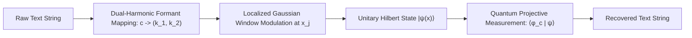

# RFC-001: Tokenless Continuous Spectral Transducer
## Subsystem Specification: Language-to-Wavefield Interface

* **Status:** `ACTIVE` (Implemented & Verified in [`src/transducer.py`](../../src/transducer.py))
* **Author:** Project Resonon / PhysLM
* **Base Document:** [Mathematical Formulation 02](../backbone/02_MATHEMATICAL_AND_PHYSICAL_FORMULATION.md)

---

## 1. Problem Statement

Standard Large Language Models rely on discrete Byte-Pair Encoding (BPE) tokenizers. BPE tokenizers introduce:
1. Artificial lexical boundary artifacts and spelling hallucinations.
2. Large discrete embedding tables ($\mathcal{O}(V \times D)$ memory, where $V \ge 32\text{k}$).
3. Inability to directly process continuous analog human signals (audio, continuous speech, analog voltages).

---

## 2. Specification: Dual-Harmonic Formant Transducer

RFC-001 replaces discrete token lookup tables with a continuous physical wave transducer inspired by biological vocal tract acoustics (formants) and solid-state phonon modes.

### 2.1 Forward Transduction (Encoding)
For a sequence of characters $c_0, c_1, \dots, c_{L-1}$ spaced at spatial coordinates $x_j = x_{\text{start}} + j \cdot \Delta x_{\text{step}}$:

$$\psi(x) = \frac{1}{\sqrt{\mathcal{N}}} \sum_{j=0}^{L-1} \exp\left(-\frac{(x - x_j)^2}{2 \sigma^2}\right) \cdot \frac{1}{2} \left[ \exp(i k_{1, c_j} x) + \exp(i k_{2, c_j} x) \right]$$

where:
* $\Delta k = \frac{2\pi}{W}$ ensures local harmonic orthogonality.
* $k_{1, c} = (1 + (c \pmod{10})) \cdot \Delta k$ (Low-frequency formant bank).
* $k_{2, c} = (12 + (c // 10)) \cdot \Delta k$ (High-frequency formant bank).
* $\mathcal{N} = \int |\psi(x)|^2 dx$ enforces unitary probability normalization.

### 2.2 Reverse Transduction (Quantum Projective Decoding)
At each coordinate center $x_j$, the physical wave field is projected onto candidate quantum probe states $\langle \phi_{j, c}|$:

$$c_j = \arg\max_{c \in \Sigma} \left| \langle \phi_{j, c} | \psi \rangle \right| = \arg\max_{c \in \Sigma} \left| \int \phi_{j, c}^*(x) \psi(x) \, dx \right|$$

---

## 3. Verification & Compliance Criteria
* **Unitary Norm:** $\left| \int |\psi|^2 dx - 1.0 \right| < 10^{-6}$ unconditionally.
* **Orthogonal Cross-Talk:** Overlap between distinct characters at the same position $\langle \phi_a | \phi_b \rangle < 10^{-12}$.
* **Round-Trip Reconstruction:** 100% exact character recovery verified across test strings in [`tests/test_transducer.py`](../../tests/test_transducer.py).
