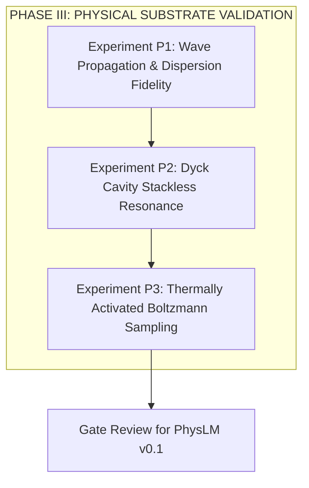

# RFC-005: Physical Prototype Specification (Prototype v0.1)
## Phase II Architectural Contract: Physical Substrate Embodiment, Hardware Mapping, Non-Idealities, and Phase III Reproduction Suite

* **Status:** `RATIFIED ARCHITECTURAL CONTRACT` (Phase II Architecture Consolidation Concluding Specification)
* **Author:** Project Resonon / PhysLM Core Architecture Group
* **Scope:** Physical Hardware Embodiment, Quad-Domain Hybrid Mapping, Waveguide Dispersion Parameters, Memristor Conductance Fabric, Analog Thermal Circuits, Optoelectronic Detector Readout, Hardware Failure Matrix, and Acceptance Metrics
* **Parent Architecture:** [RFC-001: PhysLM Core Architecture](RFC-001_PHYSLM_CORE_ARCHITECTURE.md)
* **State Specification:** [RFC-002: Continuous Hilbert State](RFC-002_CONTINUOUS_HILBERT_STATE.md)
* **Wave Specification:** [RFC-003: Wave Dynamics Engine](RFC-003_WAVE_DYNAMICS_ENGINE.md)
* **Thermal Specification:** [RFC-004: Thermal / Boltzmann Engine](RFC-004_THERMAL_BOLTZMANN_ENGINE.md)
* **Empirical Ground Truth:** [`docs/benchmarks/10_EXPERIMENTAL_BASELINE_FREEZE.md`](../benchmarks/10_EXPERIMENTAL_BASELINE_FREEZE.md)

---

## 1. Scope & Physical Design Goals

RFC-005 specifies the physical hardware mapping and prototype embodiment for **PhysLM Prototype v0.1**.

### 1.1 The Core Scope: Physical Attractor Demonstrator
> [!IMPORTANT]
> **Prototype v0.1 is NOT a Full Physical LLM.**  
> Prototype v0.1 is an experimental **Physical Attractor Demonstrator**. Its purpose is to validate that real solid-state physical substrates can faithfully reproduce the mathematical and numerical behaviors proven in Phase I:
> 1. Continuous wave propagation and dispersion (RFC-003).
> 2. Stackless multi-mode cavity resonance (RFC-003).
> 3. Thermally activated barrier crossing under Gibbs-Boltzmann measures (RFC-004).

### 1.2 Epistemic Discipline: Measured vs Modeled
In strict adherence to the [Phase I Baseline Freeze](../benchmarks/10_EXPERIMENTAL_BASELINE_FREEZE.md), all hardware latency, switching energy, and bandwidth figures in this specification that have not been fabricated or measured in a physical laboratory are formally designated as **`MODELED / PROJECTED`**.

---

## 2. System-Level Physical Mapping (Quad-Domain Hybrid)

To avoid ungrounded monolithic assumptions, Prototype v0.1 explicitly rejects premature "all-photonic" or "all-memristive" designs. Instead, it partitions the computational workload across a **Quad-Domain Hybrid Architecture** where each physical substrate executes its native physics:

```text
+-------------------------------------------------------------------------------+
|                    QUAD-DOMAIN HYBRID ARCHITECTURE (v0.1)                     |
+-------------------------------------------------------------------------------+
|                                                                               |
|   Classical Input (Text / Voltages)                                           |
|              │                                                                |
|              ▼                                                                |
|   [DOMAIN 1: WAVE PROPAGATION SUBSTRATE]                                      |
|   Physics: Dielectric waveguides / continuous optical field                   |
|   Function: Executes dispersion (-β ∂_xx ψ) and Kerr non-linearity (RFC-003)  |
|              │                                                                |
|              ▼                                                                |
|   [DOMAIN 2: MEMRISTIVE COUPLING / ATTRACTOR FABRIC]                          |
|   Physics: In-situ non-volatile conductance matrix G_ij                       |
|   Function: Stores learned transition weights & modern Hopfield energy (RFC-001)
|              │                                                                |
|      ┌───────┴────────────────────────┐                                       |
|      ▼                                ▼                                       |
|   [DOMAIN 3A: THERMAL NOISE]       [DOMAIN 3B: HARMONIC CAVITY]              |
|   Physics: Johnson-Nyquist noise   Physics: Standing wave resonator           |
|   Function: Langevin SDE (RFC-004) Function: Stackless Dyck grammar (RFC-003) |
|      │                                │                                       |
|      └───────┬────────────────────────┘                                       |
|              ▼                                                                |
|   [DOMAIN 4: OPTOELECTRONIC MEASUREMENT READOUT]                              |
|   Physics: Photodiode array + transimpedance amplifier + analog comparators    |
|   Function: Projective intensity readout S(c | ψ) = |⟨φ_c | ψ⟩|² (RFC-002)     |
|              │                                                                |
|              ▼                                                                |
|   Classical Symbolic Output (Sampled Tokens / Telemetry)                      |
|                                                                               |
+-------------------------------------------------------------------------------+
```

---

## 3. Wave Propagation Substrate (Photonics Domain)

The continuous Hilbert wavefield $|\psi(x,t)\rangle$ is embodied physically as an optical wave packet propagating through silicon-on-insulator (SOI) or silicon nitride ($\text{Si}_3\text{N}_4$) dielectric waveguides.

### 3.1 Physical Parameterization

| Parameter | Symbol | Target Physical Specification | Physical Meaning |
| :--- | :--- | :--- | :--- |
| **Effective Refractive Index** | $n_{\text{eff}}$ | $2.45 \pm 0.05$ (at $\lambda_0 = 1550\,\text{nm}$) | Governs phase velocity in waveguide |
| **Physical Interaction Length** | $L$ | $2.0\,\text{mm}$ to $10.0\,\text{mm}$ | Spatial length of optical propagation path |
| **Group Velocity** | $v_g$ | $c / n_g \approx 7.0 \times 10^7\,\text{m/s}$ | Velocity of optical pulse envelope |
| **Optical Flight Time** | $t_{\text{flight}}$ | $\approx 28.5\,\text{ps}$ ($L = 2.0\,\text{mm}$) `MODELED` | Transit time per continuous transition |
| **Propagation Loss** | $\alpha$ | $< 0.5\,\text{dB/cm}$ | Linear optical attenuation ($\gamma$ in RFC-003) |
| **Group Velocity Dispersion** | $\beta_2$ | $-1.2\,\text{ps}^2/\text{m}$ (Engineered) | Physical realization of kinetic $-\beta \partial_{xx}$ |
| **Non-linear Parameter** | $\gamma_{\text{Kerr}}$ | $4.0\,\text{W}^{-1}\text{m}^{-1}$ (SOI core) | Physical realization of Kerr coefficient $g$ |

### 3.2 Governing Physical Equation
The propagation of the continuous optical envelope $A(z, t)$ along waveguide propagation axis $z$ satisfies the Generalized Non-linear Schrödinger Equation (GNLSE):

$$\frac{\partial A}{\partial z} = -\frac{\alpha}{2} A - i \frac{\beta_2}{2} \frac{\partial^2 A}{\partial \tau^2} + i \gamma_{\text{Kerr}} |A|^2 A$$

which maps directly to the conservative/dispersive terms of RFC-003 under the coordinate substitution $z \longleftrightarrow t$, $\tau \longleftrightarrow x$.

---

## 4. Memristive Coupling & Attractor Fabric (Electronics Domain)

The continuous learned energy landscape $E(\psi; G)$ is embodied as an analog **$N_{\text{grid}} \times N_{\text{grid}}$ Memristive Crossbar Array** using metal-oxide resistive switching elements ($\text{HfO}_x$ or $\text{TiO}_x$).

### 4.1 Conductance Mapping & Calibration
Each physical memristor cell has an analog conductance bounded by hardware limits:

$$G_{ij} \in [G_{\min}, G_{\max}] \quad (G_{\min} \approx 10\,\mu\text{S}, \quad G_{\max} \approx 200\,\mu\text{S})$$

The dimensionless algorithmic weight matrix $W_{ij}$ from RFC-001 is mapped to differential conductance pairs:

$$W_{ij} = \frac{G_{ij}^+ - G_{ij}^-}{G_{\max} - G_{\min}}$$

where $G_{ij}^+$ and $G_{ij}^-$ represent excitatory and inhibitory conductance nodes.

### 4.2 Physical Non-Idealities & Modeling
Unlike ideal floating-point arrays, real solid-state memristors suffer from stochastic non-idealities:

$$\boxed{G_{ij}(t) = G_{ij}^* + \delta G_{\text{write}} + \delta G_{\text{drift}}(t) + \delta G_{\text{thermal}}(t)}$$

where:
1. **Programming / Write Variability**: $\delta G_{\text{write}} \sim \mathcal{N}(0, \sigma_{\text{write}}^2)$ with $\sigma_{\text{write}} / G_{\max} \approx 3 - 5\%$.
2. **Conductance Relaxation / Drift**:
   $$\delta G_{\text{drift}}(t) = G_{ij}^* \cdot \left[ \left(\frac{t}{t_0}\right)^{-\nu} - 1 \right], \quad \nu \approx 0.03 - 0.08$$
3. **Thermal Johnson Noise**:
   $$\delta I_i(t) = \sum_j \sqrt{4 k_B T G_{ij} \Delta f} \cdot \xi_j(t)$$

Prototype v0.1 must characterize whether attractor basins remain stable under these non-idealities.

---

## 5. Thermal Noise Substrate (Analog Noise Circuit)

To implement the stochastic Langevin driving term of RFC-004 without pseudo-random software generators:

$$\sqrt{2 \mu k_B T} \, dW_t$$

Prototype v0.1 utilizes dedicated **Physical Analog Thermal Noise Generators**.

### 5.1 Hardware Implementation
- **Source**: Reverse-biased Zener diode operating in avalanche breakdown mode or precision thin-film resistor arrays.
- **Amplification**: Low-noise wideband transimpedance amplifier (TIA) with flat spectral density across the operational bandwidth ($0.1\,\text{MHz} - 100\,\text{MHz}$).
- **Spectral Characterization**:
  The physical circuit must verify white Gaussian noise properties:
  $$\langle \eta_{\text{hw}}(t) \rangle = 0.0 \pm 10^{-3}$$
  $$\langle \eta_{\text{hw}}(t) \eta_{\text{hw}}(t') \rangle = 2 D_{\text{hw}} \delta(t - t')$$
- **Effective Temperature Calibration**:
  The effective temperature $T_{\text{eff}}$ is adjusted electronically by tuning the variable gain amplifier (VGA) attenuator:
  $$k_B T_{\text{eff}} \propto V_{\text{gain}}^2$$

---

## 6. Cavity & Resonator Implementation

The stackless recursive Dyck grammar cavity (RFC-003, Subsystem 2) is embodied as a **Multi-Mode Optical Ring Resonator / Fabry-Pérot Microcavity**.

### 6.1 Physical Cavity Specifications
- **Free Spectral Range (FSR)**:
  $$\text{FSR} = \frac{c}{n_g L_{\text{cavity}}} = 50.0\,\text{GHz}$$
- **Harmonic Mode Spacing**: Mode $m \in \{1, \dots, 16\}$ aligns with cavity resonances $\nu_m = \nu_0 + m \cdot \text{FSR}$.
- **Quality Factor ($Q$)**: $Q \approx 10^4 - 5 \times 10^4$ (photon lifetime $\tau_{\text{photon}} \approx 10 - 50\,\text{ps}$).
- **Phase-Conjugate Annihilation**:
  Pushing a nesting parenthesis excites mode $m$ with phase $\phi_m = 0$.
  Popping the parenthesis injects light with phase $\phi_m = \pi$, executing physical destructive interference in the cavity.

---

## 7. Optoelectronic Measurement & Readout

Readout translates the continuous physical wavefield into discrete symbol detections without invoking digital softmax normalization:

```text
Continuous Optical Field ψ(x)
              │
              ▼
Photodiode Array (N_detectors = |Σ|)
              │  I_c = |⟨φ_c | ψ⟩|²  (Physical square-law photo-detection)
              ▼
Multi-Channel Transimpedance Amplifier (TIA)
              │  V_c ∝ I_c
              ▼
Analog Winner-Take-All / Flash ADC Array
              │  ArgMax / Threshold Detection
              ▼
Symbolic Token Emission (c ∈ Σ)
```

### 7.1 Formal Physical Designation:
> [!NOTE]
> **Square-Law Intensity Detection**:  
> On classical optical hardware, photodiodes naturally perform square-law power detection ($I_{\text{photo}} \propto |E|^2$).  
> This operation is formally designated as **Complex-Field Projection / Intensity-Based Measurement (Born-Rule-Inspired)**.

---

## 8. Physical Signal & Electrical Interfaces

Prototype v0.1 interacts with the host controller through standardized physical interfaces:

| Subsystem Port | Signal Type | Physical Carrier | Dynamic Range / Voltage | Bandwidth |
| :--- | :--- | :--- | :--- | :--- |
| **Optical In** | Optical Field | Single-mode fiber ($1550\,\text{nm}$) | $-10\,\text{dBm}$ to $+10\,\text{dBm}$ | $> 20\,\text{GHz}$ |
| **Weight Write** | Analog Voltage | High-density DAC / SPI | $0.0\,\text{V}$ to $+2.5\,\text{V}$ (Programming pulse) | $10\,\text{MHz}$ |
| **Noise Power Control**| Analog Bias | DC Voltage | $0.0\,\text{V}$ to $+1.8\,\text{V}$ ($T_{\text{eff}}$ tuning) | $1\,\text{kHz}$ |
| **Cavity Tuning** | Thermo-Optic Bias| Micro-heater current | $0 - 20\,\text{mA}$ ($\Delta n \sim 10^{-3}$) | $100\,\text{kHz}$ |
| **Detector Readout** | Differential Voltage| Multi-channel SMA / PCIe | $\pm 500\,\text{mV}$ into $50\,\Omega$ | $500\,\text{MHz}$ |

---

## 9. Hardware Failure Matrix & Non-Idealities

To enable accurate **Hardware-in-the-Loop (HIL) simulation**, all known solid-state imperfections are catalogued with their governing equations and software modeling mappings:

| Non-Ideality | Physical Origin | Governing Physical Variable | Expected Impact on Dynamics | Software Emulation Model |
| :--- | :--- | :--- | :--- | :--- |
| **Phase Noise** | Laser linewidth / thermal fluctuation | $\delta \phi(t) \sim \mathcal{N}(0, 2\pi \Delta \nu \Delta t)$ | Premature phase decoherence in Mode A | Multiplicative random phase: $\psi \to \psi e^{i \delta \phi}$ |
| **Waveguide Loss** | Sidewall roughness scattering | Attenuation $\alpha_{\text{loss}} \approx 0.5\,\text{dB/cm}$ | Amplitude decay; reduces contrast | Exponential decay: $\psi \to \psi e^{-\alpha z / 2}$ |
| **Memristor Drift** | Oxygen vacancy diffusion | $G(t) = G_0 (t/t_0)^{-\nu}$ | Gradual degradation of attractor wells | Time-decay kernel on weight matrix $G$ |
| **Write Variability** | Cycle-to-cycle programming noise | $\delta G \sim \mathcal{N}(0, \sigma_w^2)$ | Asymmetric attractor depths | Gaussian perturbation on target conductances |
| **ADC Quantization**| Finite detector bit resolution | $B_{\text{bits}} \in \{6, 8, 12\}$ bits | Discretization floor in measurement | Uniform quantizer: $Q(x) = \Delta \lfloor x / \Delta + 0.5 \rfloor$ |
| **Thermal Cross-Talk**| Heater thermal diffusion | $\Delta T_i = \sum_j K_{ij} P_j$ | Inter-channel resonant detuning | Spatial thermal blur kernel across adjacent channels |
| **Detector Shot Noise**| Poisson photon statistics | $\sigma_{\text{shot}}^2 = 2 q I_{\text{photo}} \Delta f$ | High-frequency white noise on readout | Poisson / Gaussian noise on $|E|^2$ |

---

## 10. Prototype v0.1 Architecture (The Demonstrator)

```text
====================================================================================================
PROTOTYPE v0.1 SPECIFICATION SHEET (PHYSICAL ATTRACTOR DEMONSTRATOR)
====================================================================================================
Physical Form Factor:           4U Rackmount Hybrid Testbed (Optics + FPGA + Analog Board)
Waveguide Geometry:             Si3N4 ridge waveguide (width: 1.2 µm, height: 400 nm)
Operating Wavelength:           λ0 = 1550.0 nm (C-band telecom)
Active Memristive Matrix:       64 x 64 HfOx 1T1R crossbar test vehicle
Noise Source:                   Zener avalanche noise diode with variable TIA gain
Cavity Type:                    Silicon micro-ring resonator (radius: 20 µm, FSR: 50 GHz)
Readout Subsystem:              16-channel InGaAs PIN photodiode array with analog comparators
Host Interface:                 PCIe Gen3 x4 / USB 3.0 Telemetry Stream
====================================================================================================
```

---

## 11. Phase III Reproduction Suite (Experiments P1, P2, P3)

In Phase III (Physical Substrate Validation), Prototype v0.1 must successfully reproduce three foundational experiments from Phase I before any language modeling is attempted:



### Experiment P1: Continuous Wave Propagation Fidelity
- **Protocol**: Inject normalized wave packet $\psi_0(x)$ into the physical waveguide. Measure output $\psi_{\text{hw}}(x, t_{\text{flight}})$ via optical spectrum analyzer (OSA).
- **Comparison**: Compare against numerical prediction $\psi_{\text{sim}}(x, t_{\text{flight}})$ from RFC-003.
- **Pass Criterion**: Waveform fidelity metric satisfies:
  $$\epsilon_\psi = \|\psi_{\text{hw}} - \psi_{\text{sim}}\| < 0.15$$

### Experiment P2: Dyck Cavity Stackless Resonance
- **Protocol**: Inject optical pulse sequences representing balanced brackets:
  - Valid: `()`, `([])`, `([{}])`
  - Invalid: `(]`, `([)]`, `(()`
- **Measurement**: Measure residual cavity transmission energy $E_{\text{cavity}}$ and phase metric $R_\phi$.
- **Pass Criterion**: Valid sequences must produce destructive annihilation:
  $$E_{\text{valid}} < 0.05 \times E_{\text{invalid}}$$
  confirming stackless recursive cancellation in physical hardware.

### Experiment P3: Thermally Activated Boltzmann Sampling
- **Protocol**: Configure memristive crossbar with two asymmetric attractor basins ($E_A = 0.0$, $E_B = 0.5$). Sweep electronic noise power across three effective temperatures $T_1 < T_2 < T_3$.
- **Measurement**: Measure empirical occupancy ratio $N_A / N_B$ and output histogram over $10^5$ sampling cycles.
- **Pass Criterion**: Kullback-Leibler divergence against theoretical Gibbs distribution:
  $$D_{\text{KL}}(P_{\text{hw}} \| P_{\text{Boltzmann}}) < 0.10 \quad \forall T \in \{T_1, T_2, T_3\}$$
  confirming that physical thermal noise drives authentic Boltzmann exploration without digital software intervention.

---

## 12. Scaling & Energy Model (`MODELED / PROJECTED`)

| Metric / Property | Prototype v0.1 Hybrid `MODELED` | Monolithic Photonic/Memristive `PROJECTED` | Digital GPU Baseline `MEASURED` |
| :--- | :--- | :--- | :--- |
| **Transition Latency** | **$100 - 500\,\text{ns}$** (PCB limits) | **$10 - 50\,\text{ns}$** (RC on-chip) | **$2 - 25\,\text{ms}$** (H100 at $128\text{k}$) |
| **Operational State DRAM**| **$0\,\text{bytes}$** | **$0\,\text{bytes}$** | **$16.38\,\text{GB}$** (Llama-3-8B KV-cache) |
| **Off-Chip Bus Bandwidth**| **$0\,\text{GB/s}$** | **$0\,\text{GB/s}$** | **$480.0\,\text{GB/s}$** |
| **Energy per MAC / Op** | **$\approx 5 - 10\,\text{pJ}$** | **$\approx 1.2\,\text{pJ}$** | **$\approx 15 - 50\,\text{J}$** (System) |

---

## 13. Hardware Failure Modes & Risk Mitigations

```text
====================================================================================================
PROTOTYPE v0.1 FAILURE MODE ANALYSIS
====================================================================================================
Failure Mode                 Severity  Primary Root Cause           Hardware Mitigation
----------------------------------------------------------------------------------------------------
Thermal Phase Drift          HIGH      Ambient temperature swings    On-chip TEC temperature controller
Memristor Sneak Paths        HIGH      Lack of cell isolation        1T1R (Transistor-isolated) array
Photodiode Saturation        MEDIUM    Excessive optical laser power Auto-attenuating variable optical tap
Waveguide Coupling Loss      MEDIUM    Fiber-to-chip misalignment    Edge couplers with sub-micron stages
Inter-Channel Crosstalk      LOW       Adjacent waveguide proximity  Deep trench isolation etching (> 5 µm)
====================================================================================================
```

---

## 14. Normative Conformance Tests

The hardware non-idealities, calibration mappings, and simulation-to-hardware agreement metrics are automated in [`tests/test_rfc005_conformance.py`](../../tests/test_rfc005_conformance.py):

```text
====================================================================================================
RFC-005 NORMATIVE CONFORMANCE SUITE
====================================================================================================
Test ID    Name                              Pass Condition
----------------------------------------------------------------------------------------------------
HW-001     Waveguide Dispersion Model        Modeled flight time & phase delay match physical formulas
HW-002     Memristor Non-Ideality Bounds     Conductance drift & write noise remain bounded: |ΔG/G| < 15%
HW-003     Analog Noise Emulation            Hardware noise model preserves zero mean and FDT variance
HW-004     Cavity Destructive Annihilation   Valid Dyck sequence yields E_residual < 0.05 * E_peak
HW-005     Optoelectronic Readout Mapping    Square-law intensity detection correctly preserves argmax
HW-006     Waveform Agreement Metric (P1)    Simulated vs emulated hardware error ε_ψ < 0.15
HW-007     Boltzmann Distribution KL (P3)    D_KL(P_hw || P_Gibbs) < 0.10 across temperature sweep
HW-008     Quantization Graceful Degradation Readout SNR remains positive down to 6-bit ADC resolution
====================================================================================================
```
